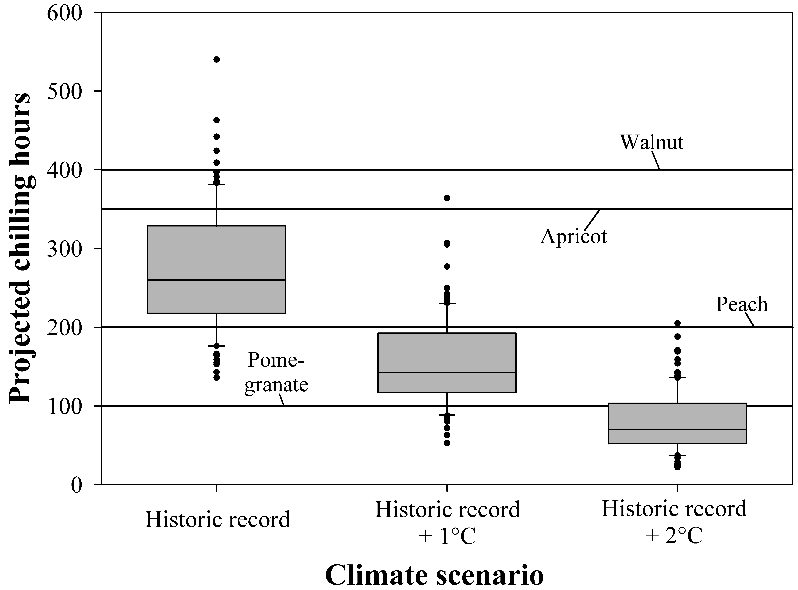
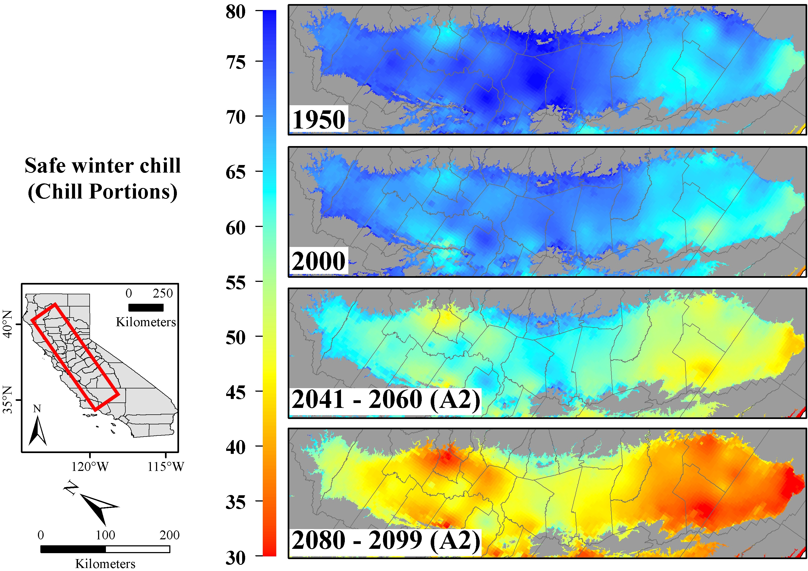
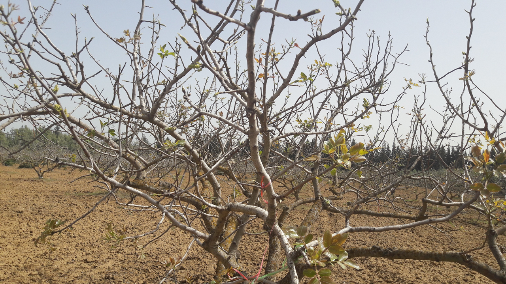
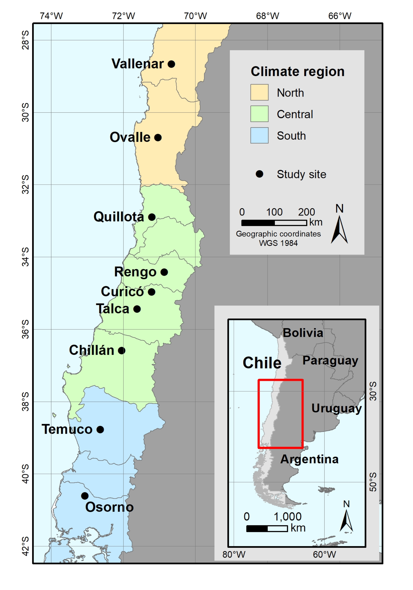

# Introduction to the Module

Hi, my name is Jacqueline. I’m a master’s student in Crop Sciences at the [University of Bonn](https://www.uni-bonn.de/de). This is my learning logbook for the module “Tree phenology analysis with R”. This module provides an overview of methods to study the impact of climate and climate change on tree phenology. It is designed for those who may not yet be familiar with phenology or how to analyze climate change effects, but it also aims to offer new insights for those with existing knowledge in these areas. Initially developed for M.Sc. students in Crop Science and Agricultural Science and Resource Management in the Tropics and Subtropics (ARTS) at the University of Bonn, the material is accessible to anyone interested.

The content begins with an introduction to phenology (with a special emphasis on dormancy) as well as an overview of climate change. It then focuses heavily on the practical application of the `chillR` package for R. This tool has been continuously developed since 2013 by [Prof. Dr. Eike Lüdeling](https://www.gartenbauwissenschaften.uni-bonn.de/en/staff/eike-luedeling), head of the HortiBonn research group at the [Institute of Crop Science and Resource Conservation (INRES)](https://www.inres.uni-bonn.de/de) at the University of Bonn, to support this type of analysis.

## Learning goals

This course will offer the following skills and experiences:

-   Knowledge about phenology
-   Knowledge about tree dormancy
-   Understanding of climate change impact projection methods
-   Appreciation for the importance of risks and uncertainty in climate change projection
-   Understanding of how to use some staple tools of R code development
-   Ability to use `chillR` functions for climate change impact projection
-   Ability to use `chillR` functions for tree phenology analysis
-   Understanding and ability to use the `PhenoFlex` dormancy analysis framework

<!--chapter:end:index.Rmd-->

# Tools

This course is designed to provide knowledge about tree phenology, climate change, and related topics, along with hands-on exercises to demonstrate the functionalities of the `chillR` package. It is recommended to document everything learned in a `learning logbook`. To engage in these practical components effectively, various tools are required. Since `chillR` is an [R](https://www.r-project.org/) package, using R, preferably through the [RStudio](https://posit.co/download/rstudio-desktop/) interface, will be necessary.

Although it is possible to run RStudio on a local computer and save files directly on the hard drive, this approach differs from the methods commonly used by professional programmers. To align with standard programming practices, familiarity with certain code development tools is essential. This course will therefore cover the basics of using [Git](https://git-scm.com/) and [GitHub](https://github.com/), which are valuable tools for organizing, securing, and sharing code. Additionally, proper documentation techniques in R will be introduced, focusing on creating well-structured, professional reports using [RMarkdown](https://rmarkdown.rstudio.com/). While these tools may seem complex at first, their usefulness is likely to become clearer as they are used throughout the module.

[Dr. Cory Whitney](https://inresgb-lehre.iaas.uni-bonn.de/author/dr.-cory-whitney/), a researcher at HortiBonn, has volunteered to create tutorial videos to provide an introduction to these tools.

## R and RStudio

The first video *Using R and RStudio* demonstrates how to install and run [R](https://www.r-project.org/) and [RStudio](https://posit.co/download/rstudio-desktop/):

```{r, echo=FALSE}
knitr::include_url("https://www.youtube.com/embed/WT3tKlzCZgo")
```

## Git and Github

The next video Using *Git and Github* explores the programming version control environment [Git](https://git-scm.com/) and the interface [GitHub](https://github.com/), which is used to access these features:

```{r, echo=FALSE}
knitr::include_url("https://www.youtube.com/embed/S98XJTyIVaY")
```

## Rmarkdown

In the last video *Using R Mardown*, [R Markdown](https://rmarkdown.rstudio.com/) will be examined, a powerful tool that enables the creation of sophisticated reports, websites, and more from R code:

```{r, echo=FALSE}
knitr::include_url("https://www.youtube.com/embed/hh4wyP8tvkI")
```

<!--chapter:end:02-tools.Rmd-->

# Tree dormancy

This chapter is presented by [Dr. Erica Fadón](https://scholar.google.de/citations?hl=de&user=MTmTnnsAAAAJ), a researcher at [HortiBonn from 2018 to 2021](https://inresgb-lehre.iaas.uni-bonn.de/author/dr.-erica-fadon-adrian/), who explores dormancy in temperate fruit trees. This topic remains complex and has many unanswered questions. A central question for researchers is, “How do trees know when to flower?” Although it seems clear that trees bloom in spring, the reality is more complicated. This chapter provides a better understanding of dormancy and demonstrates how to use the `chillR` tool to predict flowering times, even in the face of challenges posed by global warming.

## Learning goals

-   Learn about dormancy in temperate fruit trees
-   Be able to identify the phenological stages of a fruit tree and understand phenology data sets
-   Describe and compare the two methodologies (empirical and statistical) to identify the chilling and forcing periods of a certain cultivar

## Introduction to dormancy

Tree dormancy is a state of reduced activity that occurs when environmental conditions are unfavorable, especially during winter. This state acts as a survival strategy, helping trees withstand extreme temperatures, water shortages, and other stress factors. During dormancy, trees slow down or stop their growth to conserve energy and avoid damage. Dormancy is a continuous process divided into three phases:

-   **Dormancy Establishment**
-   **Endo-Dormancy**
-   **Eco-Dormancy**

Dormancy establishment is the process where temperate trees transition from active growth in summer to a dormant state in autumn. This shift is mainly triggered by shorter daylight hours and decreasing temperatures, causing buds to form, growth to stop, and leaves to fall. The importance of these factors varies by species, with some trees responding more to day length and others to temperature.

Endo-dormancy is a phase of dormancy controlled by the plant's internal factors, where growth is suppressed even under favorable conditions. It requires a period of cold exposure (chilling) to release the buds from this state, preventing premature growth during temporary warm spells in winter. Low temperatures are the main trigger for breaking endo-dormancy, while the role of light (photoperiod) is still uncertain.

Eco-dormancy is the phase after endo-dormancy, where buds have regained their ability to grow but remain inactive due to unfavorable environmental conditions, mainly low temperatures. During this phase, growth is on hold until warmer temperatures trigger it. Heat accumulation is needed to resume growth. Eco-dormancy ends when enough heat has been accumulated, leading to visible growth changes, typically in late winter or early spring.

The below video *Introduction to dormancy* by [Dr. Erica Fadón](https://scholar.google.de/citations?hl=de&user=MTmTnnsAAAAJ) gives the basic knowledge of this dormancy phases and processes that regulate dormancy.

```{r, echo=FALSE}
knitr::include_url("https://www.youtube.com/embed/qh9AZDmOm3o")
```

## Dormancy physiology

Dormancy as a whole is the result of complex interactions between numerous physiological processes that occur in different parts of the tree, such as buds, twigs, meristems, and vascular tissues. We divide these processes into four main themes:

-   **Transport:** occurs at both the whole-plant and cellular levels
-   **Phytohormone Dynamics:** behavior and levels of plant hormones during dormancy
-   **Genetic and Epigenetic Regulation:** how genetic factors and their modifications influence dormancy
-   **Dynamics of Nonstructural Carbohydrates:** changes in carbohydrate levels that affect dormancy

The following figure from the study ["A conceptual framework for Winter Dormancy in Deciduous Trees"](https://www.mdpi.com/2073-4395/10/2/241#) by Fadón et al. (2015) presents a conceptual framework of winter dormancy in deciduous trees and summarizes the three dormancy phases along with their respective physiological processes.


All the processes depicted are explained in detail in the video below, *Dormancy Physiology* by [Dr. Erica Fadón](https://scholar.google.de/citations?hl=de&user=MTmTnnsAAAAJ).

```{r,echo=FALSE}
knitr::include_url("https://www.youtube.com/embed/HriLSz77QEQ")
```

## Experimental and statistical determination of chilling and forcing periods

Dormancy consists of two phases where temperatures have opposite effects on flowering. During endodormancy, higher chill accumulation leads to earlier flowering, whereas similar cool temperatures during ecodormancy can delay flowering. The challenge lies in differentiating between these two phases, as the tree buds appear to be in the same developmental stage throughout. To address this, there are two methods available:

-   **Experimental method:** collecting buds periodically during winter, exposing them to favorable growth conditions, and evaluating bud break to determine when dormancy is overcome

-   **Statistical method:** uses long-term phenological data and temperature records to estimate the dates of chilling fulfillment and heat accumulation through partial least squares (PLS) regression analysis

The video *Dormancy determination* covers the experimental and statistical methods to determine the chilling and forcing periods for temperate fruit trees to overcome dormancy and initiate growth. It explains the concept of dormancy, its phases (endodormancy and ecodormancy), and the temperature requirements for breaking dormancy.

```{r, echo=FALSE}
knitr::include_url("https://www.youtube.com/embed/hMM27ktlzBM")
```

## Phenology record and BBCH scale

Phenology is the study of periodic events in biological life cycles and how these are influenced by seasonal and interannual variations in climate. This module will involve working with phenology data sets, primarily focusing on a specific stage, usually budbreak, even though trees pass through various developmental stages during the year. These stages are typically identified by numerical codes.

To describe these growth stages systematically, the BBCH scale is employed. This internationally standardized system outlines the growth and developmental phases of plants. The BBCH scale consists of ten main stages, known as principal growth stages, which are numbered from 0 to 9. Each of these main stages is further divided into substages, enabling a more detailed description of a plant's development.

Principal growth stages:

| Stage | Description |
|----|----|
| 0 | Germination / sprouting / bud development |
| 1 | Leaf development (main shoot) |
| 2 | Formation of side shoots / tillering |
| 3 | Stem elongation or rosette growth / shoot development (main shoot) |
| 4 | Development of harvestable vegetative plant parts or vegetatively propagated organs / booting (main shoot) |
| 5 | Inflorescence emergence |
| 6 | Flowering (main shoot) |
| 7 | Development of fruit |
| 8 | Ripening or maturity of fruit and seed |
| 9 | Senescence, beginning of dormancy |

For a comprehensive overview of phenology and the BBCH scale, the video *Phenology* by [Dr. Erica Fadón](https://scholar.google.de/citations?hl=de&user=MTmTnnsAAAAJ) is recommended. In this video, Dr. Fadón explains the concept of phenology and how the BBCH scale uses numerical codes to represent the different developmental stages of trees, from budding and flowering to fruit ripening and leaf fall.

```{r, echo=FALSE}
knitr::include_url("https://www.youtube.com/embed/Ssoe6Ahv88Y")
```

## `Excercises` on tree dormancy

1.  *Put yourself in the place of a breeder who wants to calculate the temperature requirements of a newly released cultivar. Which method will you use to calculate the chilling and forcing periods? Please justify your answer.*

As a breeder aiming to calculate the temperature requirements for the chilling and forcing periods of a newly released cultivar, I would use the experimental method to determine the chilling and forcing periods. Here's my justification:

-   **Direct measurement of bud response:** The experimental method allows me to directly observe when buds break under controlled temperature conditions. By regularly collecting buds during winter and placing them in ideal growth conditions, I can determine exactly when dormancy ends. This practical approach gives me quick and useful information about the specific cultivar

-   **Specific to the cultivar:** Each cultivar has its own unique chilling and forcing needs. The experimental method looks at the specific traits of the new cultivar, making sure the results are relevant and applicable to that variety

-   **Immediate results for breeding decisions:** The experimental method provides quick evaluations of bud break, allowing me to make faster decisions about breeding and managing the new cultivar

2.  *Which are the advantages (2) of the BBCH scale compared with earlier scales?*

-   **Standardization:** The BBCH scale provides a standardized framework for describing plant growth stages, enabling consistent communication and comparisons across studies
-   **Detailed Staging**: It offers a more granular categorization of developmental stages using a two-digit system, allowing for a better understanding of plant development and environmental impacts.

3.  *Classify the following phenological stages of sweet cherry according to the BBCH scale:*


-   **left image:** BBCH stage 55 (single flower buds visible (still closed), green scales slightly open)
-   **middle image:** BBCH stage 65 (full flowering: at least 50% of flowers open, first petals falling)
-   **right image:** BBCH stage 89 (fruit ripe for harvesting)

<!--chapter:end:03-tree_dormancy.Rmd-->

# Climate change and impact projection

Before using `chillR`, there's a brief overview of climate change, because the upcoming work will mainly focus on predicting how global warming might affect phenology-related metrics.

Climate change refers to long-term changes in temperatures and weather patterns. While these changes can occur naturally — such as fluctuations in solar activity — since the 19th century, climate change has primarily been driven by human activities, particularly the burning of fossil fuels like coal, oil, and natural gas.

## The drivers of climate change

To understand what's happening to our planet, it's important to know the main causes of climate change. This helps us spot false claims that things like the sun, cities, or natural changes in the climate are the main reasons for global warming. The truth is simple: human-made greenhouse gas emissions are heating up our planet, and the only way to stop this is to greatly reduce these emissions.

The video below, titled *Climate Change 1 - Drivers of Climate Change*, is the first in a series of four videos on the topic of climate change presented by [Eike Lüdeling](https://www.gartenbauwissenschaft.uni-bonn.de/author/prof.-dr.-eike-luedeling/). It provides a comprehensive overview of the primary drivers of global climate change, such as greenhouse gases, aerosols, solar radiation, ozone, and others.

```{r, echo=FALSE}
knitr::include_url("https://www.youtube.com/embed/lFtc-Y5OYNs")
```

## What's already known

The next video, *Climate Change 2 - Recent Warming*, explores climatic changes that have already occurred or for which there is substantial evidence. It demonstrates that the planet has experienced significant warming for several decades, almost globally.

```{r, echo=FALSE}
knitr::include_url("https://www.youtube.com/embed/sLmfKcvsWow")
```

## Future scenarios

When it comes to climate change, the most severe impacts are still ahead. This is largely due to the significantly higher rate of greenhouse gas emissions observed over the past few decades, with no signs of a slowdown in the near future. As a result, the human-induced 'forcing' effect on our climate has reached unprecedented levels, making it likely that future changes will occur even more rapidly than those we have already witnessed. The next video *Climate Change 3 - Future scenarios* introduces the methods that climate scientists employ to forecast future conditions and presents climate scenarios developed by these scientists, which researchers in other fields can use to project the impacts of climate change on ecological and agricultural systems.

```{r, echo=FALSE}
knitr::include_url("https://www.youtube.com/embed/PX6fAxBEkCE")
```

## Impact projections approaches

Having robust climate scenarios is essential, but they only take us partway toward reliable assessments of climate change impacts. A potentially greater challenge lies in translating these climate scenarios into biological consequences. To achieve this, we need impact models or other methods to derive the impacts of climate change. The last video *Climate change 4 - impact projection approaches* introduces various methods for projecting climate impacts.

```{r, echo=FALSE}
knitr::include_url("https://www.youtube.com/embed/3Q8HF4E7rkM")
```

## `Exercises` on climate change

1.  *List the main drivers of climate change at the decade to century scale, and briefly explain the mechanism through which the currently most important driver affects our climate.*

The main drivers of climate change on a decade-to-century scale include:

-   **Greenhouse Gases (GHGs):** GHGs like carbon dioxide (CO₂), methane (CH₄), and nitrous oxide (N₂O) trap heat in the atmosphere, leading to the greenhouse effect, which raises Earth's temperature. The increase in these gases is primarily due to human activities, such as burning fossil fuels, industrial processes, and deforestation

-   **Aerosols:** Particles in the atmosphere that can cool the climate by reflecting sunlight. They come from both natural sources (e.g. sea salt, dust, volcanic eruptions, fires) and human activities (e.g.power plants, cars, fires and cook stove). They are major climate driver in industrial centers (e.g. China)

-   **Sun:** Solar radiation heats the Earth, with minor fluctuations occurring over time due to cycles in solar activity, such as sunspots. Although these variations contribute only a small portion to the current climate changes, they play a significant role in driving climate change over geological timescales

-   **Ozone:** Ozone in the stratosphere protects Earth from UV-B radiation, while tropospheric ozone acts as a greenhouse gas and contributes to warming

-   **Surface albedo:** The reflectivity of the Earth's surface affects how much solar energy is absorbed. Light surfaces (like ice) reflect more energy, while dark surfaces (like forests or oceans) absorb more, influencing the planet's heat balance. Changes in surface reflectivity, such as melting ice and snow, decrease the albedo effect, leading to more heat absorption and further warming

The currently most important driver of climate change is greenhouse gases, particularly CO₂. The mechanism through which CO₂ affects the climate involves the greenhouse effect: CO₂ molecules in the atmosphere absorb long-wave radiation emitted from the Earth's surface and re-radiate it in all directions, including back toward the surface. This process traps heat and increases global temperatures, driving many of the changes we observe in climate patterns.

2.  *Explain briefly what is special about temperature dynamics of recent decades, and why we have good reasons to be concerned.*

In recent decades, global temperatures have been rising at a faster rate than at any other time in human history. This trend is evident from the fact that the hottest years on record have all occurred within the last few decades. One striking example is the extreme heat in Siberia in the spring of 2020, where temperatures were up to 8°C above the recent average. This trend is particularly concerning because it is mainly driven by human activities, especially the emission of greenhouse gases. Unlike previous climate changes, which took place slowly over long periods, today’s fast rise in temperatures increases the risk of triggering dangerous effects, like melting permafrost and losing ice cover, which could make global warming even worse. Even a small increase of 1.5°C could seriously upset the balance of our climate, showing how important it is to take action against these human-caused changes.

3.  *What does the abbreviation ‘RCP’ stand for, how are RCPs defined, and what is their role in projecting future climates?*

RCP stands for Representative Concentration Pathways, which are essential scenarios used in climate modeling to project potential future greenhouse gas emissions and their impacts on the climate. RCPs are defined by the level of radiative forcing — measured in watts per square meter (W/m²) — that is expected by the end of the 21st century. Each pathway corresponds to a specific amount of greenhouse gas concentrations, which can significantly influence global temperatures. The role of RCPs is to serve as inputs for climate models, helping to produce future climate scenarios, which are essential for understanding the potential impacts of climate change and planning appropriate mitigation and adaptation strategies.

4.  *Briefly describe the 4 climate impact projection methods described in the fourth video.*

The four climate impact projection methods described in the fourth video are:

-   **Statistical models:** These models establish relationships between climate parameters and impact measures, such as crop yield. They use historical data to explain past trends and project future climate impacts. Their primary limitation is that the statistical relationships may not remain valid under future climate conditions, and they may overlook important factors

-   **Species Distribution Modeling:** Also known as ecological niche modeling, this method predicts the future distribution of species by relating current presence or absence data to climatic parameters. However, these models may assume species are in equilibrium with the climate, which is often not the case

-   **Process based models:** These models aim to represent all major system processes using equations, capturing the scientific knowledge of processes like crop growth, phenology or hydrology. However, they are limited by the lack of complete understanding of complex systems, and often require extensive parameterization or assumptions

-   **Climate Analogue models:** This method identifies current locations with climates similar to those expected in the future at another site, offering real-world examples that can guide adaptation strategies. However, they may be limited by differences in non-climatic factors and lack of suitable data, making it difficult to draw clear conditions

<!--chapter:end:04-climate_change.Rmd-->

# Winter chill projections

This section provides an overview of how winter chill can be modeled. It summarizes past studies on this topic, aiming to clarify the methodological aspects that lead to the analyses conducted. By the end of this lesson, most of the analyses presented in the discussed papers should be understandable.

## Learning goals

-   Be aware of past studies that have projected climate change impacts on winter chill
-   Get a rough idea of how such studies are done
-   Get curious about how to do such studies

## Winter chill in Oman

During his doctoral studies at the University of Kassel, [Prof. Dr. Eike Lüdeling](https://www.gartenbauwissenschaft.uni-bonn.de/author/prof.-dr.-eike-luedeling/) became interested in winter chill while participating in research on mountain oases in Oman. Initially focused on calculating nutrient budgets for the oases, particularly in the "Hanging Gardens" of Ash Sharayjah, the study shifted when many fruit trees failed to bear fruit. This led to the hypothesis that insufficient winter chill might be the issue, especially since the oases hosted temperate species such as pomegranates (*Punica granatum*), walnuts (*Juglans regia*), and apricots (*Prunus armeniaca*).

To investigate this, temperature loggers were placed in three oases at different levels of elevation, allowing for the study of chill accumulation along an elevation gradient. A map of the study area illustrates the locations of the oases:


A nearby long-term weather station provided valuable data, although its location - 1000 meters above the lowest oasis - limited its representativeness. Since records were available from the oases, transfer functions were defined to derive oasis temperatures from the long-term data. These transfer functions were set up using PLS regression, which, in hindsight, wasn’t a very good idea, to directly calculate hourly temperatures in the oases from the daily records of the official station at Saiq.


This approach facilitated the calculation of hourly temperatures, which were essential for assessing winter chill dynamics over several years.


The findings were submitted to the journal Climatic Change ([Luedeling et al., 2009b](https://link.springer.com/article/10.1007/s10584-009-9581-7)), where reviewers suggested incorporating future climate scenarios. To address this, the LARS-WG weather generator was employed to simulate plausible weather conditions for the oases under scenarios of 1°C and 2°C warming.



The results illustrated the potential impacts of climate change on winter chill, marking the beginning of a career focused on chill modeling.

## Chill model sensitivity

After completing a PhD at the University of Kassel, [Prof. Dr. Eike Lüdeling](https://www.gartenbauwissenschaft.uni-bonn.de/author/prof.-dr.-eike-luedeling/) became a Postdoctoral Scholar at the University of California at Davis, where his research focused on climate change impacts on winter chill in California's Central Valley, a key region for temperate fruit tree production.

Upon arriving in California, it became evident that the choice of chill model significantly impacts winter chill quantification. Initially, the simplest model was chosen due to a lack of programming skills, but further investigation highlighted the importance of model selection. Extensive library research revealed the need for a thorough examination of various chill models. Knowledge gained in Oman was utilized to create temperature scenarios for multiple locations, allowing for the analysis of how chill accumulation would likely change in the future.

The analysis focused on changes predicted by various models for the same locations and future scenarios. Here are the locations examined:


The results revealed considerable variation in chill projections for these locations. The analysis illustrated significant differences in estimates of chill losses by 2050, indicating that not all models could accurately represent winter chill dynamics. Ultimately, the Dynamic Model emerged as the most reliable option, prompting its primary use in subsequent research.


However, challenges arose with the complexity of the Dynamic Model, which required outdated Excel software for calculations. Additionally, the data processing steps necessary to generate credible temperature scenarios proved cumbersome and error-prone, highlighting the need to develop programming skills for more efficient analysis.

## Winter chill in California

The primary goal during the time in California was to create a winter chill projection for the Central Valley, an important region for fruit and nut production. Utilizing California's extensive network of weather stations, the plan involved using data from over 100 stations and generating multiple climate scenarios. To manage this complex task efficiently, a decision was made to automate most processes, leading to an exploration of programming.

The automation was implemented using JSL, a programming language associated with the statistics software JMP, which facilitated the handling of the data. Despite some challenges, the automation was largely successful, though running the weather generator manually for each station remained tedious. Ultimately, projections were generated for all stations, illustrating chill accumulation over 100 plausible winter seasons for each climate scenario.

To present the results effectively, a metric called 'Safe Winter Chill' was developed, defined as the 10th percentile of the chill distribution, indicating the minimum chill amount that would be exceeded in 90% of the years. Here’s an illustration of the Safe Winter Chill metric:


A method for spatially interpolating the station results was also established, leading to the creation of maps that depicted winter chill prospects for the Central Valley. Here’s one of the maps that resulted from this:



This analysis was published in the journal PLOS ONE ([Luedeling et al., 2009d](https://journals.plos.org/plosone/article?id=10.1371/journal.pone.0006166)).

## Winter chill ratios

Following the automation of processing steps in JSL, attention turned to creating a global winter chill projection. The Global Summary of the Day database was identified as a valuable data source, featuring records from thousands of weather stations. The project proved challenging due to limited programming skills. Data processing was carried out on six computers operating around the clock for several weeks, likely a result of initial setup difficulties rather than the complexity of the analyses. In the end, data for about 5,000 weather stations were processed, generating multiple chill metrics.

This extensive dataset allowed for a comparison of chill models by calculating the ratios between various chill metrics at each station. If these ratios had been consistent worldwide (e.g., one Chill Portion always equating to ten Chilling Hours), any chill model could have been reliably used. However, significant variations in chill metric ratios were observed globally.


This study was published in the International Journal of Biometeorology ([Luedeling & Brown, 2011a](https://link.springer.com/article/10.1007/s00484-010-0352-y)).

## A global projection of future winter chill

Using the same analytical methods, a global projection of the potential impacts of climate change on winter chill was also generated:


The regions marked in red and orange on the lower two maps may experience significant impacts on fruit and nut production due to decreasing winter chill. With substantial chill losses, it is unlikely that growers will be able to sustain their current tree cultivars. Notably, the Mediterranean region is expected to be particularly affected.


This prompted collaboration with partners in the Mediterranean region and other countries with similar climates, such as South Africa and Chile.

## Winter chill in Germany

Germany is not highlighted as particularly vulnerable to chill losses, and an analysis of historical chilling trends from 1950 supports this observation:


## Winter chill in Tunisia

Prospects for orchards in Tunisia are particularly challenging due to the region being close to the warmest limits for many fruit and nut tree species. An assessment published in 2018 examined past and future trends in winter chill for an orchard in Central Tunisia, following a seven-year gap from earlier studies. This delay stemmed from other professional commitments and the difficulty of obtaining suitable future climate data for chill modeling.

While climate change data is widely available, much of it is presented as spatial grids, making it cumbersome to work with. Each climate scenario requires numerous grids for temperature and rainfall, leading to substantial data storage needs, sometimes exceeding 700 GB. Soon after establishing a processing structure for these datasets, the IPCC introduced the Representative Concentration Pathways (RCPs), rendering earlier scenarios outdated and complicating the analysis further, especially given the limited data transfer capabilities while based in Kenya.

Collaboration with colleagues in Tunisia, particularly [Haifa Benmoussa](https://scholar.google.de/citations?hl=de&user=DdV9jsAAAAAJ), revealed that tree crops like almonds and pistachios are highly vulnerable to climate change impacts. Fortunately, a new climate database specifically for Africa, called AFRICLIM, was developed, facilitating the acquisition and processing of relevant climate scenarios. This allowed for the incorporation of new functions in `chillR` to sample from AFRICLIM grids and produce the necessary climate projections.


The figure, which is to be created by the end of the semester, illustrates the historical development of chill accumulation at a specific location, with observed values represented by red dots and typical chill distributions shown as boxplots. These data were generated using a weather generator that is calibrated with historical weather data and produces artificial annual weather records. The generator was also used to create future scenarios based on the AFRICLIM database.

The analysis indicates that in none of the future scenarios does the cultivation of pistachios or high-chill almonds remain viable. This conclusion is supported by observations in Tunisia, where, after the warm winter of 2015/16, many pistachio trees barely developed any flowers, leading to crop failures.



## Winter chill in Chile

AFRICLIM addressed the challenge of obtaining future climate data for Africa but did not fully meet the needs for integrating climate change projections into `chillR`. It was limited to African data, and users seeking information for single locations had to download large datasets, which was inefficient. A more effective solution was needed to access data quickly for individual weather stations globally.

An early resource was ClimateWizard, developed by [Evan Girvetz](https://scholar.google.de/citations?user=Yh2sQY4AAAAJ&hl=de), which initially provided gridded data but later included a script for extracting information for specific locations. This functionality was eventually made available through an API at CIAT, allowing access to outputs from 15 climate models for the latest RCP scenarios. This advancement enabled [Eduardo Fernández](https://scholar.google.de/citations?hl=de&user=ibSma_AAAAAJ) to analyze past and future chill development across nine locations in Chile, expanding the geographic scope of the research.



The following diagram illustrates the assessment of past and future winter chill across nine locations in Chile:


Eduardo preferred a different plot design and utilized the `ggplot2` package, a robust plotting tool for R, to redesign it. The complexity of having data from multiple sites made interpretation challenging, prompting Eduardo to creatively summarize key information for each scenario. He presented this information as a heat map, simplifying the visualization.


## Chill projection for Patagonia

Certain regions may become more suitable for agriculture as the climate changes. An analysis was conducted to assess the climatic suitability for fruit and nut trees in Patagonia, southern Argentina, which is located at the southern frontier of agriculture:


Weather station records for all locations on the map were obtained, enabling the calibration of a weather generator and the download of climate projections from the ClimateWizard database. This facilitated the creation of past and future temperature scenarios for all stations, as well as the computation of winter chill and other agroclimatic metrics. However, the results of the winter chill calculations were not particularly noteworthy, as minimal changes were projected.


Climate change could potentially enhance land suitability for fruit trees by providing increased summer heat:


A further beneficial development is a likely reduction in the number of frost hours:


While the changes observed may appear minor, they are likely to shift many locations from a climate that is too cool for agriculture, particularly for fruit trees, to a more optimal situation. This presents a rare instance of potentially positive news related to climate change, though it is important to acknowledge that these changes could have negative consequences for natural ecosystems and other agricultural systems.

## Chill model comparison

Eduardo Fernandez recently utilized the climate change analysis framework to enhance previous chill model comparisons, significantly building on earlier work. He compiled a collection of 13 methods for quantifying chill accumulation from existing literature and applied these models to datasets from several locations in Germany, Tunisia, and Chile, which are part of the PASIT project. A map illustrates the locations included in this analysis.


The expectation was that the models would show significant differences in the extent of changes they predicted, and this anticipation was indeed fulfilled:


The figure illustrates the changes predicted by 13 different models across various sites and climate scenarios, categorized into three groups: warm, moderate, and cool. Eduardo’s analysis reveals significant discrepancies among the models, highlighting the risks of selecting the most convenient model for predictions. The variation in predictions is evident in the color distribution across the rows of the panels, with a uniform color indicating consistency among models—something that is not observed here.

For locations in Tunisia and Chile, the predictions mainly concern the extent of chill losses, ranging from mild to alarming. In Germany, the situation is even less clear, with some models predicting increases in chill and others predicting decreases.

These findings underscore the importance of model choice, as many models may be arbitrary and can be disregarded, yet uncertainties remain regarding which models accurately represent future conditions. This area of research offers opportunities for further exploration and innovation.

## Chill projection for all of Tunisia

The study projected climate change impacts on winter chill for an orchard near Sfax in Central Tunisia, but the region is not the most favorable for temperate fruit and nut tree cultivation. Tunisia is climatically diverse, featuring mountains, plains, coastal areas, and interior deserts, leading to significant variation in historical and future chill availability across the country.

Under the leadership of [Haifa Benmoussa](https://scholar.google.de/citations?hl=de&user=DdV9jsAAAAAJ), the team mapped chill accumulation throughout Tunisia using a framework previously developed. This analysis utilized data from 20 weather stations in Tunisia and neighboring countries. By applying the established analytical framework to each location, they were able to interpolate results and create chill maps that illustrate the trends in chill availability in Tunisia over the past few decades:


The process of interpolating site-specific results into a comprehensive map for Tunisia involves some areas for improvement. Currently, the methodology uses site-specific predictions of Safe Winter Chill, defined as the 10th percentile of the chill distribution derived from annual temperature dynamics generated by the weather model. This information is then interpolated using the Kriging technique.

In addition, the elevations of the locations where chill was modeled are also considered. A linear model is fitted to establish a relationship between chill accumulation and elevation. Using a Digital Elevation Model (DEM), the differences between the model-derived elevations from weather stations and the actual elevations of each location are calculated. This difference, not accounted for in the initial chill surface derived from weather station data, is corrected using the established elevation-chill relationship.

While this method seems reasonable for Tunisia, it may not be suitable for cooler regions like Germany, where the relationship between elevation and chill availability may not be linear. The resulting projection of future chill for Tunisia is displayed in the following map:


The projections reveal significant concern regarding winter chill in Tunisia. The Dynamic Model, which is regarded as a reliable predictor, indicates substantial decreases in Chill Portions, the units used by the model. This trend poses serious challenges for much of the country. Even in areas where some winter chill is expected to persist, farmers will need to adapt their practices, as the tree species currently cultivated are suited to past climate conditions. Adaptation strategies may include shifting to tree cultivars with lower chilling requirements, provided such options are available.

## Revisiting chill accumulation in Oman

After a decade of exploration in other regions, the analysis turned back to Oman, where there was a desire to enhance the initial study of chill accumulation. The first assessment had limitations, particularly concerning model selection and a lack of adequate future climate data. With encouragement from [Prof. Dr. Andreas Bürkert](https://scholar.google.de/citations?user=ZNvcJJ8AAAAJ&hl=de), a more robust evaluation became possible using the climate change analysis framework. This involved incorporating new methods to convert daily temperatures into hourly data. Updated assessments of past winter chill and future forecasts for the oases of Al Jabal Al Akhdar were produced, with the findings published in *Climatic Change* ([Buerkert et al., 2020](https://link.springer.com/article/10.1007/s10584-020-02862-8)).

## `Exercises` on past chill projections

1.  *Sketch out three data access and processing challenges that had to be overcome in order to produce chill projections with state-of-the-art methodology.*

-   **Accessing Climate Data for Specific Locations**:\
    Previous climate datasets like AFRICLIM and ClimateWizard only provided large-scale data. To get weather data for specific locations without downloading too much extra information, an API was created to quickly access data for single sites

-   **Converting Daily to Hourly Temperature Data**:\
    Chill models need hourly temperature data, but many databases only give daily averages. Early methods for converting daily to hourly data weren't very good, especially in areas with unique temperatures. Improved algorithms were developed to estimate hourly temperatures more accurately from daily data

-   **Handling Large Volumes of Climate Model Outputs**:\
    Studying different climate futures involves dealing with a lot of data from many climate models, which can be hard to manage. To handle this large amount of data effectively, workflows were streamlined and selective processing techniques were used

2.  *Outline, in your understanding, the basic steps that are necessary to make such projections.*

To make climate-based chill projections for specific regions, here are the essential steps typically involved:

-   **Data Collection and Calibration:** collect historical weather data and use it to calibrate a weather generator for realistic temperature simulations

-   **Model Selection and Scenario Setup:** choose relevant climate models and emission scenarios to explore various future climates

-   **Generate Temperature Projections:** downscale climate data, converting it to daily or hourly temperatures as needed for chill calculations

-   **Chill Calculation:** apply chill models to estimate chill accumulation across different climate scenarios

-   **Analysis and Visualization:** compare chill projections across models and scenarios and visualize the findings

-   **Interpretation:** validate projections with observed data where possible and assess agricultural impacts and adaptation needs

<!--chapter:end:05-winter_chill.Rmd-->

# Manual chill

This chapter explains how to calculate Chilling Hours using R and the `chillR` package. Chilling Hours measure the number of hours where temperatures are between 0°C and 7.2°C, which is important for certain plants to meet their cold requirements during dormancy and grow properly.

## Learning goals

-   Learn about some basic R operations we need for calculating Chilling Hours
-   Be able to calculate Chilling Hours
-   Understand what an R function is
-   Be able to write your own basic function

## Chilling hours calculation using chillR

Basic models like the Chilling Hours Model are simple and can be calculated manually, especially if familiar with R or spreadsheet software. This example will show how to understand and use the functions in the `chillR` package to calculate these chill hours.

### **Data Requirements**

The Chilling Hours Model is relatively simple but requires hourly temperature data. A common challenge is the unavailability of such data, though approximations can be made from daily records using `chillR` tools. For this example, a sample dataset, `Winters_hours_gaps`, provided within `chillR`, was used. It contains hourly temperature data recorded in 2008 from a walnut orchard in Winters, California, and is structured with columns for year, month, day, hour, and temperature.

### Loading and Preparing Data

To work with `chillR`, the package was loaded using `library(chillR)`. The data can also be imported via `read.table()` or `read.csv()` for external datasets. The `Winters_hours_gaps` dataset was filtered to retain only the essential columns: year, month, day, hour, and temperature. This cleaned version, stored in a new dataframe called `hourtemps`, ensures the data is in the correct format for calculating Chilling Hours:

```{r, warning=FALSE}
#install.packages("chillR")
library(chillR)
library(knitr)
library(pander)
library(kableExtra)
library(tidyverse)
```

```{r}
hourtemps <- Winters_hours_gaps[,c("Year",
                                   "Month",
                                   "Day",
                                   "Hour",
                                   "Temp")]
```

```{r, echo = FALSE}

kable(hourtemps[1:10,], align = rep("c", ncol(hourtemps))) %>% 
  kable_styling(
    bootstrap_options = c("striped", "hover"), 
    position = "center", 
    font_size = 14,   
    full_width = TRUE
  )

```

### **Manual Calculation of Chilling Hours**

Chilling Hours are defined as any hour where the temperature falls between 0°C and 7.2°C. A logical comparison was used in R to identify whether each hour met this criterion:

```{r}
hourtemps[, "Chilling_Hour"] <- hourtemps$Temp >= 0 & hourtemps$Temp <= 7.2
```

```{r, echo = FALSE}
kable(hourtemps[1:10, ], align = rep("c", ncol(hourtemps))) %>%
  kable_styling(
    bootstrap_options = c("striped", "hover"), 
    position = "center", 
    font_size = 14,   
    full_width = TRUE,
  )

```

A new column, `Chilling_Hour`, was created, indicating whether a given hour was a valid Chilling Hour (TRUE or FALSE). These values can then be summed to calculate the total number of Chilling Hours for any period using the `sum()` function.

### Automation with Functions

A function is a tool that automates a particular procedure. It consists of a name, some arguments that are passed to the function, and some code that should be executed. To avoid repeating manual calculations, a reusable function called `CH` was created to automate the addition of a `Chilling_Hour` column:

```{r}
CH <- function(hourtemps) {
  hourtemps[, "Chilling_Hour"] <- hourtemps$Temp >= 0 & hourtemps$Temp <= 7.2
  return(hourtemps)
}
```

This function applies to any appropriately structured dataset. Additionally, a more complex function, `sum_CH`, was developed to calculate the total Chilling Hours between two specific dates:

```{r}
sum_CH <- function(hourtemps, Start_Year,
                              Start_Month,
                              Start_Day, 
                              Start_Hour, 
                              End_Year, 
                              End_Month, 
                              End_Day, 
                              End_Hour) 
  
{hourtemps[,"Chilling_Hour"] <- hourtemps$Temp > 0 &
                                hourtemps$Temp  <= 7.2

  Start_Date <- which(hourtemps$Year == Start_Year & 
                      hourtemps$Month == Start_Month &
                      hourtemps$Day == Start_Day &
                      hourtemps$Hour == Start_Hour)
  
  End_Date <- which(hourtemps$Year == End_Year &
                    hourtemps$Month == End_Month &
                    hourtemps$Day == End_Day & 
                    hourtemps$Hour == End_Hour)
  
  CHs <- sum(hourtemps$Chilling_Hour[Start_Date:End_Date])
  return(CHs)
}

```

This function calculates Chilling Hours for a user-defined date range, using the `which()` function to identify the relevant rows in the dataset corresponding to the start and end dates.

To simplify the parameter passing, compact strings in the format `YEARMODAHO` (year, month, day, and hour as consecutive numbers) can be used instead of individual parameters for year, month, day, and hour. The start and end times are now passed as strings, from which the required values are extracted using the `substr()` function and converted to numeric values with `as.numeric()`.

```{r}
sum_CH <- function(hourtemps, 
                   startYEARMODAHO,
                   endYEARMODAHO)
{hourtemps[,"Chilling_Hour"] <- hourtemps$Temp > 0 &
  hourtemps$Temp <= 7.2

startYear <- as.numeric(substr(startYEARMODAHO, 1, 4))
startMonth <- as.numeric(substr(startYEARMODAHO, 5, 6))
startDay <- as.numeric(substr(startYEARMODAHO, 7, 8))
startHour <- as.numeric(substr(startYEARMODAHO, 9, 10))

endYear <- as.numeric(substr(endYEARMODAHO, 1, 4))
endMonth <- as.numeric(substr(endYEARMODAHO, 5, 6))
endDay <- as.numeric(substr(endYEARMODAHO, 7, 8))
endHour <- as.numeric(substr(endYEARMODAHO, 9, 10))


Start_row <- which(hourtemps$Year == startYear &
                   hourtemps$Month == startMonth &
                   hourtemps$Day == startDay &
                   hourtemps$Hour == startHour
)
End_row <- which(hourtemps$Year == endYear &
                 hourtemps$Month == endMonth &
                 hourtemps$Day == endDay &
                 hourtemps$Hour == endHour
)

CHs <- sum(hourtemps$Chilling_Hour[Start_row:End_row])
return(CHs)

}

```

### Application Example

The functions created allow for efficient calculation of Chilling Hours. For instance, using the `sum_CH()` function, it was calculated that between April 1st and October 11th, 2008, the walnut orchard experienced 77 Chilling Hours:

```{r}
sum_CH(hourtemps, startYEARMODAHO =2008040100,
                  endYEARMODAHO = 2008101100)
```

## `Exercises` on basic chill modeling

1.  *Write a basic function that calculates warm hours (\>25°C).*

```{r}
WH <- function(data)
  {data[, "Warm_Hour"] <- data$Temp > 25
  return(data)
}
```

2.  *Apply this function to the* `Winters_hours_gaps` *dataset.*

```{r, eval = FALSE}
WH(Winters_hours_gaps)
```

```{r, echo = FALSE}
library(chillR)
result <- WH(Winters_hours_gaps)
kable(result[1:10, ], align = rep("c", ncol(hourtemps))) %>%
  kable_styling(
    bootstrap_options = c("striped", "hover"), 
    position = "center", 
    font_size = 14,   
    full_width = TRUE 
  )
```

3.  *Extend this function, so that it can take start and end dates as inputs and sums up warm hours between these dates.*

```{r}
sum_WH <- function(data, 
                   startYEARMODAHO,
                   endYEARMODAHO)
  
{data[,"Warm_Hour"] <- data$Temp > 25

startYear <- as.numeric(substr(startYEARMODAHO, 1, 4))
startMonth <- as.numeric(substr(startYEARMODAHO, 5, 6))
startDay <- as.numeric(substr(startYEARMODAHO, 7, 8))
startHour <- as.numeric(substr(startYEARMODAHO, 9, 10))

endYear <- as.numeric(substr(endYEARMODAHO, 1, 4))
endMonth <- as.numeric(substr(endYEARMODAHO, 5, 6))
endDay <- as.numeric(substr(endYEARMODAHO, 7, 8))
endHour <- as.numeric(substr(endYEARMODAHO, 9, 10))


Start_Date <- which(data$Year == startYear &
                    data$Month == startMonth &
                    data$Day == startDay &
                    data$Hour == startHour)

End_Date <- which(data$Year == endYear &
                  data$Month == endMonth &
                  data$Day == endDay &
                  data$Hour == endHour)

WHs <- sum(data$Warm_Hour[Start_Date:End_Date])
return(WHs)
}
```

Application Example:

```{r}
sum_WH(Winters_hours_gaps, startYEARMODAHO = 2008080100, 
                           endYEARMODAHO = 2008083100)


```

During the month of August 2008, from the 1st to the 31st, the walnut orchard experienced a total of 283 warm hours (defined as hours when the temperature exceeded 25°C).

<!--chapter:end:06-manual_chill.Rmd-->

# Chill

In this chapter, various chill models will be explored using the `chillR` package in R, which simplifies the calculation of chilling hours and other dormancy-related metrics based on temperature data.

```{r, echo=FALSE,message=FALSE,warning=FALSE}
require(tidyr)
require(reshape2)
require(dplyr)
require(kableExtra)
require(chillR)
```

## Learning goals

-   Learn how to run chill models using `chillR`
-   Learn how to produce your own temperature response model in `chillR`

## `Chilling_Hours()` function

The `Chilling_Hours()` function calculates the time during which temperatures fall within a key range for chill accumulation. It takes hourly temperature data as input and, by default, provides the cumulative amount of chilling accumulated over time.

```{r}
Chilling_Hours(Winters_hours_gaps$Temp)[1:100]
```

The result will show the first 100 values, where the cumulative chilling hours increase as the temperature falls within the specified range.

## Utah Model

The Utah Model assigns different weights to various temperature ranges, reflecting their impact on chill accumulation. The `Utah_Model()` function in `chillR` calculates these weighted chilling contributions for each hour of temperature data. The output will show the Utah model values for the first 100 hours, where positive, zero, and negative weights are applied based on the temperature:

```{r}
Utah_Model(Winters_hours_gaps$Temp)[1:100]
```

## Creating Custom Chill Models with `step_model()`

The `step_model()` function, part of the `chillR` package, enables the creation of custom chill models based on temperature thresholds and weights. This process involves defining a data frame that specifies temperature ranges and their corresponding weights. Here’s an example of a data frame that defines temperature ranges and their corresponding weights:

```{r}
df <- data.frame(
  lower = c(-1000, 1, 2, 3, 4, 5,    6),
  upper = c(    1, 2, 3, 4, 5, 6, 1000),
  weight = c(   0, 1, 2, 3, 2, 1,    0))
```

```{r, echo = FALSE}
kable(df, align = rep("c", ncol(df))) %>%
  kable_styling(bootstrap_options = c("striped", "hover"),
                position = "center",
                font_size = 14,
                full_width = TRUE)
```

A function called `custom()` implements a chill model based on this data frame. This function is then applied to the `Winters_hours_gaps` dataset to calculate the chilling contributions:

```{r}
custom <- function(x) step_model(x, df)
custom(Winters_hours_gaps$Temp)[1:100]
```

## Dynamic model

The Dynamic Model provides a more complex and reliable approach to calculating chill, with the `Dynamic_Model()` function handling the intricate equations involved. This function can be easily applied to the `Winters_hours_gaps` dataset, producing output that displays dynamic chill values for the first 100 hours, reflecting the underlying physiological processes:

```{r}
Dynamic_Model(Winters_hours_gaps$Temp)[1:100]
```

## `Chilling` and `tempResponse` functions

The `chillR` package offers several functions for analyzing hourly temperature data, including wrapper functions that enable the computation of chill between specific start and end dates. The `chilling()` function automatically calculates various basic metrics, including Chilling Hours, Utah Model, Dynamic Model, and Growing Degree Hours. It is important to use the `make_JDay()` function to add Julian dates (which count the days of the year) to the dataset, ensuring proper functionality.

```{r}
chill_output <- chilling(make_JDay(Winters_hours_gaps), Start_JDay = 90, End_JDay = 100)
```

```{r, echo = FALSE}
kable(chill_output, align = rep("c", ncol(Winters_hours_gaps))) %>%
  kable_styling("striped",
                position = "center",
                font_size = 14,
                full_width = TRUE)%>%
  scroll_box(width = "100%")
```

However, there may be instances where not all metrics are desired, or there is a need for different metrics altogether. In such cases, the `tempResponse` function can be employed. This function is similar to `chilling()` but offers the flexibility to take a list of specific temperature models to be computed as input.

```{r}
chill_output <- tempResponse(make_JDay(Winters_hours_gaps), 
                       Start_JDay = 90, 
                       End_JDay = 100, 
                       models = list(Chill_Portions = Dynamic_Model, GDH = GDH))
```

```{r, echo = FALSE}
kable(chill_output, align = rep("c", ncol(chill_output))) %>%
  kable_styling("striped", 
                position = "center", 
                font_size = 14, 
                full_width = TRUE,  
                bootstrap_options = c("striped", "hover", "responsive"))
```

This will return only the Dynamic Model and Growing Degree Hours (GDH**)** values for the specified period.

## `Exercises` on chill models

1.  *Run the* `chilling()` *function on the* `Winters_hours_gap` *dataset.*

```{r}
august <- chilling(make_JDay(Winters_hours_gaps), Start_JDay = 214, End_JDay = 244)
```

```{r, echo = FALSE}
kable(august, align = rep("c", ncol(august))) %>%
  kable_styling("striped", 
                position = "center", 
                font_size = 14, 
                full_width = FALSE,  
                bootstrap_options = c("striped", "hover", "responsive")) %>%
  scroll_box(width = "100%")
```

2.  *Create your own temperature-weighting chill model using the* `step_model()` *function.*

```{r}
df <- data.frame(
  lower = c(-1000, 0,  5, 10, 15, 20,   25),  
  upper = c(    0, 5, 10, 15, 20, 25, 1000), 
  weight = c(   0, 1,  2,  3,  2,  1,    0))

custom <- function(x) step_model(x, df)
```

```{r, echo = FALSE}
library(kableExtra)
kable(df, align = rep("c", ncol(df))) %>%
  kable_styling(bootstrap_options = c("striped", "hover"),
                position = "center",
                font_size = 14,
                full_width = TRUE)
```

3.  *Run this model on the* `Winters_hours_gaps` *dataset using the* `tempResponse()` *function.*

```{r}
models <- list(
  Chilling_Hours = Chilling_Hours,
  Utah_Chill_Units = Utah_Model,
  Chill_Portions = Dynamic_Model,
  GDH = GDH,
  custom = custom)

result <- tempResponse(make_JDay(Winters_hours_gaps), 
                       Start_JDay = 214, 
                       End_JDay = 244, 
                       models)
```

```{r, echo = FALSE}
kable(result, align = rep("c", ncol(result))) %>% 
  kable_styling(
    bootstrap_options = c("striped", "hover", "responsive"), 
    position = "center", 
    font_size = 14,   
    full_width = TRUE) %>%
   scroll_box(width = "100%")
```

<!--chapter:end:07-chill.Rmd-->

# Making hourly temperatures

## Learning goals

-   Understand why we often need hourly temperature data and why we need ways of making them out of daily data
-   Understand some basic algorithms for making hourly data from daily minimum and maximum temperatures
-   Understand how we can make use of observed hourly temperatures to produce our own empirical transfer function that can make hourly from daily data
-   Be able to use the respective `chillR` functions that implement these steps

```{r, echo=FALSE, message=FALSE, warning=FALSE}
require(chillR)
require(ggplot2)
require(tidyr)
require(kableExtra)
```

## Generating hourly temperatures

With the Chilling Hours function developed, the next challenge arises from the limited availability of hourly temperature data, as most sources provide only daily minimum and maximum temperatures. This limitation complicates the direct calculation of Chilling Hours. Various methods have been employed to address this issue, including relating Chilling Hours to minimum temperatures (Crossa-Raynaud, 1955) or using complex equations.

With better computing tools, some researchers started to assume that daily minimum and maximum temperatures occur at specific times and used linear interpolation for the hours in between, creating a triangular shape for daily temperature patterns ([Baldocchi & Wong, 2008](https://link.springer.com/article/10.1007/s10584-007-9367-8)).

```{r triangular, out.width="80%", out.height="50%", echo=FALSE}
KA_hours <- KA_weather[10:20, ]
KA_hours[, "Hour"] <- 0
KA_hours$Hour[nrow(KA_hours)] <- 23
KA_hours[, "Temp"] <- 0
KA_hours <- make_all_day_table(KA_hours, timestep = "hour")

for (i in 2:nrow(KA_hours))
{
  if (is.na(KA_hours$Tmin[i]))
    KA_hours$Tmin[i] <- KA_hours$Tmin[i - 1]
  if (is.na(KA_hours$Tmax[i]))
    KA_hours$Tmax[i] <- KA_hours$Tmax[i - 1]
}
KA_hours$Temp <- NA

KA_hours$Temp[which(KA_hours$Hour == 6)] <-
  KA_hours$Tmin[which(KA_hours$Hour == 6)]
KA_hours$Temp[which(KA_hours$Hour == 18)] <-
  KA_hours$Tmax[which(KA_hours$Hour == 18)]
KA_hours$Temp <- interpolate_gaps(KA_hours$Temp)$interp

ggplot(KA_hours[20:100, ], aes(DATE, Temp)) +
  geom_line(lwd = 1.5) +
  xlab("Date") +
  ylab("Temperature (°C)") +
  theme_bw(base_size = 15)
```

While assuming a triangular temperature pattern may serve as a rough approximation, it is not entirely realistic. The rate of temperature increase in the morning differs from the rate of decrease in the evening. Additionally, the timing of the lowest daily temperature varies significantly throughout the year, particularly outside of equatorial regions. Therefore, it is important to take these variations into account.

## Idealized daily temperature curves

A major breakthrough in modeling daily temperature curves was made when [Dale E. Linvill](https://journals.ashs.org/hortsci/view/journals/hortsci/25/1/article-p14.xml) from Clemson University published a paper in 1990. He combined two mathematical equations: a sine curve to represent warming during the day and a logarithmic decay function for cooling at night. The times for sunrise and sunset defined the transition between these phases, and the length of each phase was linked to the amount of daylight. This method allowed for more accurate daily temperature curves than previous approaches, but not all researchers adopted these equations due to a lack of awareness or data processing skills.

One challenge with Linvill's equations was their dependence on local sunrise and sunset times. While these can be calculated from observations, having a general method would help researchers. Fortunately, for areas without major geographical features, sunrise and sunset times can be calculated based on solar system geometry. Although agricultural scientists may not be familiar with this, they can use insights from other fields. The `chillR` package uses equations from [Spencer (1971)](https://www.mail-archive.com/sundial@uni-koeln.de/msg01050.html) and [Almorox et al. (2005)](https://www.sciencedirect.com/science/article/abs/pii/S0196890404001992). [Prof. Dr. Eike Lüdeling](https://inresgb-lehre.iaas.uni-bonn.de/author/prof.-dr.-eike-luedeling/) only needed to understand these equations once to code them into an R function for future use.

Bringing together these functions is similar to how the `CH()` function was developed and used in the `sum_CH` function, though the components were more complex. The result is a function that can create realistic daily temperature curves based on the latitude of a location. The provided code illustrates how to use the `daylength` function to create plots showing sunrise time, sunset time, and daylength for Klein-Altendorf (Latitude: 50.4°N) throughout the year:

```{r, out.width="80%", out.height="50%", exercise=TRUE}
Days <- daylength(latitude = 50.4, JDay = 1:365)
Days_df <-
  data.frame(
    JDay = 1:365,
    Sunrise = Days$Sunrise,
    Sunset = Days$Sunset,
    Daylength = Days$Daylength
  )
Days_df <- pivot_longer(Days_df, cols = c(Sunrise:Daylength))

ggplot(Days_df, aes(JDay, value)) +
  geom_line(lwd = 1.5) +
  facet_grid(cols = vars(name)) +
  ylab("Time of Day / Daylength (Hours)") +
  theme_bw(base_size = 15)
```

In this context, JDay refers to the Julian Date, which represents the Day of the Year. For example, January 1st is JDay 1, while December 31st is JDay 365 in regular years and JDay 366 in leap years. The `ggplot2` package is used for creating attractive plots, and the ideal input for it is a data frame. Therefore, the outputs from the `daylength()` function were first converted into a data frame. Additionally, the three time series - Sunrise, Sunset, and Daylength - were organized into a stacked format using the `pivot_longer` command from the `tidyr` package.

The `stack_hourly_temps()` function in the `chillR` package integrates these daily dynamics. This function requires a dataset containing daily minimum and maximum temperatures, specifically with columns labeled `Tmin`, `Tmax`, `Year`, `Month`, and `Day`. The latitude of the location must also be provided. Using these inputs, the function applies the previously discussed equations to calculate hourly temperatures, and it can also output sunrise and sunset times if desired.

To demonstrate this process, another dataset included with `chillR`, called `KA_weather`, will be used. This data frame contains temperature data from the University of Bonn’s experimental station at Klein-Altendorf. The first 10 rows of the `KA_weather` dataset will be shown for illustration:

```{r, echo = FALSE}
kable(KA_weather[1:10,], align = rep("c", ncol(KA_weather))) %>% 
  kable_styling(
    bootstrap_options = c("striped", "hover"), 
    position = "center", 
    font_size = 14,   
    full_width = TRUE
  )
```

The following process describes how hourly temperatures can be calculated based on the idealized daily temperature curve:

```{r, echo=TRUE, eval=FALSE}
stack_hourly_temps(KA_weather, latitude = 50.4)
```

```{r, echo = FALSE}

KA_hourly <- stack_hourly_temps(KA_weather, latitude = 50.4)

kable(KA_hourly$hourtemps[100:120, ], row.names = FALSE, align = c("c"))  %>%
  kable_styling("striped", position = "center", font_size = 14) %>% 
  scroll_box(height="500px")
```

And here’s a plot of the data:

```{r idealized, out.width="80%", out.height="50%", echo=FALSE}

KA_hourly$hourtemps[, "DATE"] <-
  ISOdate(
    KA_hourly$hourtemps$Year,
    KA_hourly$hourtemps$Month,
    KA_hourly$hourtemps$Day,
    KA_hourly$hourtemps$Hour
  )

ggplot(KA_hourly$hourtemps[20:100, ], aes(DATE, Temp)) +
  geom_line(lwd = 1.5) +
  xlab("Date") +
  ylab("Temperature (°C)") +
  theme_bw(base_size = 15)

```

## Empirical daily temperature curves

In some locations, idealized daily temperature curves are ineffective, particularly in areas with rugged topography where temperate fruit trees may be shaded for part of the day. For example, in the Jabal Al Akhdar region of Oman, where [Prof. Dr. Eike Lüdeling](https://inresgb-lehre.iaas.uni-bonn.de/author/prof.-dr.-eike-luedeling/) initially studied winter chill, various oases in the deeply incised Wadi Muaydin canyon were investigated. Trees near the top of the canyon receive significantly more sunlight than those at the bottom, which is about 1000 meters lower.


Even in the absence of mountains, the temperature curve in an orchard may not closely resemble the curve proposed by [Linvill (1990)](https://journals.ashs.org/hortsci/view/journals/hortsci/25/1/article-p14.xml) due to its unique microclimate, featuring shaded and sunny spots, dew-covered grass, and bare ground.

In the initial study on Omani oases ([Luedeling et al., 2009b](https://link.springer.com/article/10.1007/s10584-009-9581-7)), this issue was not adequately addressed. However, a recent revisit to the location aimed to improve this aspect ([Buerkert et al., 2020](https://link.springer.com/article/10.1007/s10584-020-02862-8)).

To analyze the temperature patterns, a dataset of hourly temperature data for the relevant location is needed, ideally covering an entire year or multiple years. For this exercise, the `Winters_hours_gaps` dataset from a walnut orchard near Winters, California, will be used, as the temperature logger was directly attached to a tree branch, making it unlikely for the data to exactly match the standard daily temperature curve.

The `Empirical_daily_temperature_curve()` function will be employed to determine the typical hourly temperature patterns for each month of the year, although this method could potentially be enhanced by allowing for continuous analysis instead of monthly breakdowns.

```{r}
empi_curve <- Empirical_daily_temperature_curve(Winters_hours_gaps)
```

```{r, echo = FALSE}
kable(empi_curve[1:48, ], align = rep("c", ncol(empi_curve)))  %>%
  kable_styling("striped", position = "center", font_size = 14) %>% 
  scroll_box(height = "500px")
```

```{r}
ggplot(data = empi_curve[1:96, ], aes(Hour, Prediction_coefficient)) +
  geom_line(lwd = 1.3, 
            col = "red") + 
  facet_grid(rows = vars(Month)) + 
  xlab("Hour of the day") +
  ylab("Prediction coefficient") +
  theme_bw(base_size = 15)
```

The set of coefficients can now be applied to a daily dataset from the same location, allowing for the creation of a reasonable hourly temperature record for the orchard. This is accomplished using the `Empirical_hourly_temperatures` function, which requires a set of hourly coefficients and a daily temperature record that includes `Tmin` and `Tmax` columns.

Additionally, the `?` operator can be used to access help on how to use any function, such as `?Empirical_hourly_temperatures`.

The process also involves using the `make_all_day_table` function, which fills gaps in daily or hourly temperature records and summarizes hourly data into daily minimum and maximum temperatures.

```{r}
coeffs <- Empirical_daily_temperature_curve(Winters_hours_gaps)
Winters_daily <-
  make_all_day_table(Winters_hours_gaps, input_timestep = "hour")
Winters_hours <- Empirical_hourly_temperatures(Winters_daily, coeffs)
```

The next step is to plot the results to visualize the hourly temperature data. This allows for a comparison between the results from the empirical method, the triangular function, and the idealized temperature curve. Additionally, actual observed temperatures will be used to validate the results. To facilitate this process, the data will first be simplified for easier handling:

```{r}
Winters_hours <- Winters_hours[, c("Year", "Month", "Day", "Hour", "Temp")]
colnames(Winters_hours)[ncol(Winters_hours)] <- "Temp_empirical"
Winters_ideal <-
  stack_hourly_temps(Winters_daily, latitude = 38.5)$hourtemps
Winters_ideal <- Winters_ideal[, c("Year", "Month", "Day", "Hour", "Temp")]
colnames(Winters_ideal)[ncol(Winters_ideal)] <- "Temp_ideal"
```

The next step involves creating the 'triangular' dataset. Understanding the process behind this construction is essential.

```{r}
Winters_triangle <- Winters_daily
Winters_triangle[, "Hour"] <- 0
Winters_triangle$Hour[nrow(Winters_triangle)] <- 23
Winters_triangle[, "Temp"] <- 0
Winters_triangle <-
  make_all_day_table(Winters_triangle, timestep = "hour")
colnames(Winters_triangle)[ncol(Winters_triangle)] <-
  "Temp_triangular"

# with the following loop, we fill in the daily Tmin and Tmax values for every
# hour of the dataset

for (i in 2:nrow(Winters_triangle))
{
  if (is.na(Winters_triangle$Tmin[i]))
    Winters_triangle$Tmin[i] <- Winters_triangle$Tmin[i - 1]
  if (is.na(Winters_triangle$Tmax[i]))
    Winters_triangle$Tmax[i] <- Winters_triangle$Tmax[i - 1]
}
Winters_triangle$Temp_triangular <- NA

# now we assign the daily Tmin value to the 6th hour of every day

Winters_triangle$Temp_triangular[which(Winters_triangle$Hour == 6)] <-
  Winters_triangle$Tmin[which(Winters_triangle$Hour == 6)]

# we also assign the daily Tmax value to the 18th hour of every day

Winters_triangle$Temp_triangular[which(Winters_triangle$Hour == 18)] <-
  Winters_triangle$Tmax[which(Winters_triangle$Hour == 18)]

# in the following step, we use the chillR function "interpolate_gaps"
# to fill in all the gaps in the hourly record with straight lines

Winters_triangle$Temp_triangular <-
  interpolate_gaps(Winters_triangle$Temp_triangular)$interp
Winters_triangle <-
  Winters_triangle[, c("Year", "Month", "Day", "Hour", "Temp_triangular")]
```

The next step is to merge all the data frames to facilitate easier display and comparison of the datasets.

```{r}
Winters_temps <-
  merge(Winters_hours_gaps,
        Winters_hours,
        by = c("Year", "Month", "Day", "Hour"))
Winters_temps <-
  merge(Winters_temps,
        Winters_triangle,
        by = c("Year", "Month", "Day", "Hour"))
Winters_temps <-
  merge(Winters_temps,
        Winters_ideal,
        by = c("Year", "Month", "Day", "Hour"))
```

The dataset now includes observed temperatures along with the three approximations: triangular, idealized curve, and empirical curve. To plot this data effectively, the `Year`, `Month`, `Day`, and `Hour` columns will be converted into R's date format using `ISOdate`, and the data frame will be reorganized for better usability.

```{r}
Winters_temps[, "DATE"] <-
  ISOdate(Winters_temps$Year,
          Winters_temps$Month,
          Winters_temps$Day,
          Winters_temps$Hour)


Winters_temps_to_plot <-
  Winters_temps[, c("DATE",
                    "Temp",
                    "Temp_empirical",
                    "Temp_triangular",
                    "Temp_ideal")]
Winters_temps_to_plot <- Winters_temps_to_plot[100:200, ]
Winters_temps_to_plot <- pivot_longer(Winters_temps_to_plot, cols=Temp:Temp_ideal)
colnames(Winters_temps_to_plot) <- c("DATE", "Method", "Temperature")


ggplot(data = Winters_temps_to_plot, aes(DATE, Temperature, colour = Method)) +
  geom_line(lwd = 1.3) + ylab("Temperature (°C)") + xlab("Date")
```

The plot indicates that the triangular curve deviates significantly from the observed data, while the `Temp_empirical` and `Temp_ideal` curves appear quite similar and are difficult to differentiate.

To compare these curves more thoroughly, the Root Mean Square Error (RMSE) can be calculated, as it is useful for quantifying the alignment between predicted and observed values. The `chillR` package includes a function to perform this calculation.

```{r}
# here's the RMSE for the triangular method:
RMSEP(Winters_temps$Temp_triangular, Winters_temps$Temp)
```

```{r}
# here's the RMSE for the idealized-curve method:
RMSEP(Winters_temps$Temp_ideal, Winters_temps$Temp)
```

```{r}
# and here's the RMSE for the empirical-curve method:
RMSEP(Winters_temps$Temp_empirical, Winters_temps$Temp)
```

The results show an RMSE of 4.7 for the triangular method, 1.63 for the idealized curve method, and 1.41 for the empirical curve method. Since a lower RMSE indicates better accuracy, these results demonstrate that calibrating the prediction function with observed hourly data significantly improves accuracy, especially compared to the triangular method.

While it might be questioned how much this affects chill accumulation modeling, it is often found to make a considerable difference.

## `Exercises` on hourly temperatures

1.  *Choose a location of interest, find out its latitude and produce plots of daily sunrise, sunset and daylength.*

The Yakima Valley in Washington State, USA, is located at about 46.6° N latitude. This region has a continental climate with cold winters and hot, dry summers, creating ideal conditions for growing fruit trees. The valley is well known for producing a variety of fruits, including apples, cherries, pears, and grapes, which benefit from its distinct seasonal changes. Using the `daylength()` function, you could create plots showing daily sunrise, sunset, and day length times.

```{r, include = FALSE}
library(chillR)
library(tidyr)
library(ggplot2)
library(kableExtra)
```

```{r}
Yakima <- daylength(latitude = 46.6, JDay = 1:365)

Yakima_df <-
  data.frame(
    JDay = 1:365,
    Sunrise = Yakima$Sunrise,
    Sunset = Yakima$Sunset,
    Daylength = Yakima$Daylength
  )

Yakima_df_longer <- pivot_longer(Yakima_df, cols = c(Sunrise:Daylength))

ggplot(Yakima_df_longer, aes(JDay, value)) +
  geom_line(lwd = 1.5) +
  facet_grid(cols = vars(name)) +
  ylab("Time of Day / Daylength (Hours)") +
  theme_bw(base_size = 15)
```

2.  *Produce an hourly dataset, based on idealized daily curves, for the* `KA_weather` *dataset* *(included in* `chillR`*)*

```{r, echo = TRUE, eval = FALSE}
KA_hourly <- stack_hourly_temps(KA_weather, latitude = 50.4)
```

Based on idealized daily curves, the hourly dataset for Julian Day 6 (January 6th) is shown below:

```{r echo = FALSE}
KA_hourly <- stack_hourly_temps(KA_weather, latitude = 50.4)

kable(KA_hourly$hourtemps[121:144, ], row.names = FALSE, align = c("c"))  %>%  kable_styling("striped", position = "left", font_size = 15) %>% 
  scroll_box(height = "500px")
```

3.  *Produce empirical temperature curve parameters for the* `Winters_hours_gaps` *dataset, and use them to predict hourly values from daily temperatures (this is very similar to the example above, but please make sure you understand what’s going on).*

```{r}
# Generating empirical daily temperature curve from observed hourly data
empi_curve <- Empirical_daily_temperature_curve(Winters_hours_gaps)

# Filling gaps in daily or hourly temperature data
Winters_daily <- make_all_day_table(Winters_hours_gaps, input_timestep = "hour")

# Using empirical coefficients to predict hourly temperatures based on daily temperatures
Winters_hours <- Empirical_hourly_temperatures(Winters_daily, empi_curve)

# Make an empirical dataset 
Winters_hours <- Winters_hours[, c("Year", "Month", "Day", "Hour", "Temp")]
colnames(Winters_hours)[ncol(Winters_hours)] <- "Temp_empirical"

# Merge data frames
Winters_temps <-
  merge(Winters_hours_gaps,
        Winters_hours,
        by = c("Year", "Month", "Day", "Hour"))
```

```{r}
# Covert Year, Month, Day and Hour columns into R's date formate and reorganizing the data frame
Winters_temps[, "DATE"] <-
  ISOdate(Winters_temps$Year,
          Winters_temps$Month,
          Winters_temps$Day,
          Winters_temps$Hour)

Winters_temps_to_plot <-
  Winters_temps[, c("DATE",
                    "Temp",
                    "Temp_empirical")]
Winters_temps_to_plot <- Winters_temps_to_plot[100:200, ]
Winters_temps_to_plot <- pivot_longer(Winters_temps_to_plot, cols=Temp:Temp_empirical)
colnames(Winters_temps_to_plot) <- c("DATE", "Method", "Temperature")

ggplot(data = Winters_temps_to_plot, aes(DATE, Temperature, colour = Method)) +
  geom_line(lwd = 1.3) + ylab("Temperature (°C)") + xlab("Date")
```

<!--chapter:end:08-making_temp.Rmd-->

# Some useful tools in R

## Learning goals

-   Get to know some neat tools in R that can make coding more elegant - and easier
-   Get introduced to the `tidyverse`
-   Learn about loops
-   Get to know the `apply` function family

## An evolving language - and a lifelong learning process

The R universe is constantly evolving, offering much more now than the original base functions. Over time, modern tools and more elegant programming styles have become integral. In the upcoming chapters, some of these new tools will be introduced, along with the basics needed to use them effectively.

## The `tidyverse`

Many of the tools introduced here come from the `tidyverse` - a collection of packages developed by [Hadley Wickham](https://en.wikipedia.org/wiki/Hadley_Wickham) and his team. This collection offers many ways to improve programming skills. In this book, only the functions that are directly used will be covered. A big advantage of the tidyverse is that, with just one command - `library(tidyverse)` - all functions in the package collection become available.

## The `ggplot2` package

The `ggplot2` package, first released by [Hadley Wickham](https://en.wikipedia.org/wiki/Hadley_Wickham) in 2007, has become one of the most popular R packages because it greatly simplifies the creation of attractive graphics. The history of the package can be found [here](https://en.wikipedia.org/wiki/Ggplot2), and an introduction along with links to various tutorials is available [here](https://ggplot2.tidyverse.org/).

## The `tibble` package

A `tibble` is an enhanced version of a `data.frame` that offers several improvements. The most notable improvement is that `tibbles` avoid the common `data.frame` behavior of unexpectedly converting strings into factors. Although `tibbles` are relatively new here, they will be used throughout the rest of the book.

To create a `tibble` from a regular `data.frame` (or a similar structure), the `as_tibble` command can be used:

```{r, include = FALSE}
library(tidyverse)
```

```{r}
dat <- data.frame(a = c(1, 2, 3), b = c(4, 5, 6))
d <- as_tibble(dat)
d
```

## The `magrittr` package - pipes

`Magrittr` helps organize steps applied to the same dataset by using the pipe operator `%>%`. This operator links multiple operations on a data structure, such as a `tlibbe`, making it easier to perform tasks like calculating the sum of all numbers in the dataset:

```{r}
d %>% sum()
```

After the pipe operator `%>%`, the next function automatically takes the piped-in data as its first input, so it’s unnecessary to specify it explicitly. Additional commands can be chained by adding more pipes. This approach allows for building more complex workflows, as shown in examples later.

## The `tidyr` package

The `tidyr` package offers helpful functions for organizing data. The `KA_weather` dataset from `chillR` will be used here to illustrate some of these functions:

```{r, include = FALSE}
library(chillR)
```

```{r}
KAw <- as_tibble(KA_weather[1:10,])
KAw
```

### `pivot_longer`

The `pivot_longer` function, introduced previously, is useful for reshaping data from separate columns (like `Tmin` and `Tmax`) into individual rows. In this setup, each day’s record will have a row for `Tmin` and another for `Tmax`. This transformation is often necessary for tasks like plotting data with the `ggplot2` package. The function can be combined with a pipe for a streamlined workflow:

```{r}
KAwlong <- KAw %>% pivot_longer(cols = Tmax:Tmin)
KAwlong
```

In this example, it was necessary to specify the columns to stack. The `pivot_longer` function serves a similar purpose to the `melt` function from the `reshape2` package, which was used previously and in earlier book editions. However, `pivot_longer` is more intuitive, so it will be used throughout the remaining chapters.

### `pivot_wider`

The `pivot_wider` function allows for the opposite transformation of `pivot_longer`, converting rows back into separate columns:

```{r}
KAwwide <- KAwlong %>% pivot_wider(names_from = name) 
KAwwide
```

The `names_from` argument in `pivot_wider` specifies the column that will provide the headers for the new columns. In some cases, `pivot_wider` might work without this argument, but it’s generally recommended to include it for clarity and to ensure that the function behaves as expected, especially with more complex datasets.

### `select`

The `select` function allows users to choose a subset of columns from a `data.frame` or `tibble`:

```{r}
KAw %>% select(c(Month, Day, Tmax))
```

### `filter`

The `filter` function reduces a `data.frame` or `tibble` to just the rows that fulfill certain conditions:

```{r}
KAw %>% filter(Tmax > 10)
```

### `mutate`

The `mutate` function is essential for creating, modifying, and deleting columns in a `data.frame` or `tibble`. For example, it can be used to add new columns, such as converting `Tmin` and `Tmax` to Kelvin:

```{r}
KAw_K <- KAw %>% mutate(Tmax_K = Tmax + 273.15, Tmin_K = Tmin + 273.15)
KAw_K
```

To delete the columns created with `mutate`, you can set them to `NULL`. This effectively removes the specified columns from the `data.frame` or `tibble`:

```{r}
KAw_K %>% mutate(Tmin_K = NULL, Tmax_K = NULL)
```

Next, the original temperature values will be replaced directly with their corresponding Kelvin values. The following code will make these modifications to the specified columns:

```{r}
KAw %>% mutate(Tmin = Tmin + 273.15, Tmax = Tmax + 273.15)
```

### `arrange`

`arrange` is a function to sort data in `data.frames` or `tibbles`:

```{r}
KAw %>% arrange(Tmax, Tmin)
```

It is also possible to sort a `data.frame` or `tibble` in descending order:

```{r}
KAw %>% arrange(desc(Tmax), Tmin)
```

## Loops

In addition to the `tidyverse` functions, understanding loops is essential for efficient coding. Loops enable the repetition of operations multiple times without needing to retype or copy and paste code. They also allow for modifications to be made with each iteration. While detailed explanations on loops can be found elsewhere, the basics will be covered here.

There are two primary types of loops: **for loops** and **while loops**. For both types, it is necessary to provide instructions that determine how many times the loop will run, as well as what actions to perform during each iteration.

### *For* loops

In a for loop, explicit instructions dictate how many times the code inside the loop should be executed. This is typically done by providing a vector or list of elements, directing R to run the code for each of these elements. As a result, the number of executions corresponds to the number of elements in the vector or list. A counter is needed to track the current iteration, commonly referred to as `i`, though it can be any variable name:

```{r}
for (i in 1:3) print("Hello")
```

This command executed the code three times, producing the same output with each iteration. The structure can be made more complex by including multiple lines of code within curly brackets:

```{r}
addition <- 1

for (i in 1:3)
{
  addition <- addition + 1
  print(addition)
}
```

The code in this loop incremented an initial value of 1 by 1 in each iteration and printed the resulting value. It is important to note that R may require explicit instructions to `print` these values when the operation is embedded within a loop.

By utilizing the index `i` within the code block, additional flexibility can be introduced to the operations performed in each iteration:

```{r}
addition <- 1

for (i in 1:3)
{
  addition <- addition + i
  print(addition)
}
```

In this iteration, the respective value of `i` was added to the initial element during each run. Additionally, `i` can be utilized in more creative ways within the loop to enhance the operations being performed:

```{r}
names <- c("Paul", "Mary", "John")

for (i in 1:3)
{
  print(paste("Hello", names[i]))
}
```

The counter in a loop does not have to be numeric; it can take on various forms, including strings. By using this flexibility, the same output as generated in the previous code block can be achieved with a different formulation:

```{r}
for (i in c("Paul", "Mary", "John"))
{
  print(paste("Hello", i))
}
```

### *While* loops

A loop can also be controlled using a `while` statement, which executes the code until a specified condition is no longer met. This approach is meaningful only if the condition can change based on the operations performed within the loop:

```{r}
cond <- 5

while (cond > 0)
{
  print(cond)
  cond <- cond - 1
}
```

Once `cond` reaches 0, the starting condition is no longer satisfied, and the code will not execute again. It is important to note that while loops can lead to issues if the condition remains true regardless of the code block's execution. In such cases, the code may become stuck and will need to be manually interrupted.

## `apply` functions

In addition to loops, R offers a more efficient way to perform operations on multiple elements simultaneously. This method, which is often faster, utilizes functions from the **apply** family: `apply`, `lapply`, and `sapply`. These functions require two key arguments: the list of items to which the operation will be applied and the operation itself.

### `sapply`

When the goal is to apply an operation to a vector of elements, the simplest function to use is `sapply`. It requires two arguments: the vector (`X`) and the function to be applied (`FUN`). For illustration, a simple function called `func` will be created, which adds 1 to an input object:

```{r}
func <- function(x)
  x + 1

sapply(1:5, func)
```

The output is a vector of numbers that are each 1 greater than the corresponding elements of the input vector. When this function is applied to a list of numbers, the output becomes a matrix, although the values remain the same:

```{r}
sapply(list(1:5), func)
```

### `lapply`

To obtain a list as the output, the `lapply` function can be used. This function treats the input element `X` as a list and returns a new list containing the same number of elements as the input. Each element in the output list corresponds to the result of applying `FUN` to the respective element of the input list:

```{r}
lapply(1:5, func)
```

If the input element `X` is a list, `lapply` treats the entire list as a single input element, applying `FUN` to the whole list and returning the result as one element in the output list. An example can help clarify this behavior:

```{r}
lapply(list(1:5), func)
```

### `apply`

The basic `apply` function is designed for applying functions to arrays, allowing operations to be performed either on the rows (`MARGIN = 1`) or on the columns (`MARGIN = 2`) of the array. While this function may not be used frequently, here are some simple examples of its functionality. For further information, it is advisable to consult the help file or explore online resources, as there are many helpful materials available.

```{r}
mat <- matrix(c(1, 1, 1, 2, 2, 2, 3, 3, 3), c(3, 3))
mat
```

```{r}
apply(mat, MARGIN = 1, sum) # adding up all the data in each row
```

```{r}
apply(mat, MARGIN = 2, sum) # adding up all the data in each column
```

## `Exercises` on useful R tools

1.  *Based on the* `Winters_hours_gaps` *dataset, use* `magrittr` *pipes and functions of the* `tidyverse` *to accomplish the following:*

-   

    a)  *Convert the dataset into a* `tibble`

-   

    b)  *Select only the top 10 rows of the dataset*

```{r, include = FALSE}
library(tidyverse)
library(chillR)
library(ggplot2)
```

```{r}
WHG <- as_tibble(Winters_hours_gaps[1:10, ])
WHG
```

-   

    c)  *Convert the* `tibble` *to a* `long` *format, with separate rows for* `Temp_gaps` *and* `Temp`

To see the difference between the columns `Temp_gaps` and `Temp`, rows 279 to 302 (Julian Day 15) are used below:

```{r}
WHG <- as_tibble(Winters_hours_gaps[279:302, ])
WHGlong <- WHG %>% pivot_longer(cols = Temp_gaps:Temp)
WHGlong
```

-   

    d)  *Use* `ggplot2` *to plot* `Temp_gaps` *and* `Temp` *as facets (point or line plot)*

```{r, warning = FALSE}
ggplot(WHGlong, aes(Hour, value)) +
  geom_line(lwd = 1.5) +
  facet_grid(cols = vars(name)) +
  ylab("Temperature (°C)") +
  theme_bw(base_size = 15)
```

-   

    e)  *Convert the dataset back to the* `wide` *format*

```{r}
WHGwide <- WHGlong %>% pivot_wider(names_from = name)
WHGwide
```

-   

    f)  *Select only the following columns:* `Year`, `Month`, `Day` *and* `Temp`

```{r}
WHG %>% select(c(Year, Month, Day, Temp))
```

-   

    g)  *Sort the dataset by the* `Temp` *column, in descending order*

```{r}
WHG %>% arrange(desc(Temp))
```

2.  *For the* `Winter_hours_gaps` *dataset, write a* `for` *loop to convert all temperatures* *(*`Temp` *column) to degrees Fahrenheit*

So that the execution of the following code does not take too long, only Julian Day 15 (rows 279 to 302) is used here. To convert the entire `Temp` column to Fahrenheit, just omit `[279:302]`

```{r}
Temp <- Winters_hours_gaps$Temp[279:302]

for (i in Temp)
{
  Fahrenheit <- i * 1.8 + 32 
  print(Fahrenheit)
}
```

3.  *Execute the same operation with a function from the* `apply` *family*

Here it is the same as in 2, just omit `[279:302]` to convert the entire `Temp` column

```{r}

x <- Winters_hours_gaps$Temp

fahrenheit <- function(x)
  x * 1.8 + 32

sapply(x[279:302], fahrenheit)
```

4.  *Now use the* `tidyverse` *function* `mutate` *to achieve the same outcome*

```{r}
WHG_F <- WHG %>% mutate(Temp_F = Temp * 1.8 + 32)
WHG_F
```

<!--chapter:end:09-tools_R.Rmd-->

# Getting temperature data

## Learning goals for this lesson

-   Appreciate the need for daily temperature data
-   Know how to get a list of promising weather stations contained in an international database
-   Be able to download weather data using `chillR` functions
-   Know how to convert downloaded data into `chillR` format

## Temperature data needs

Temperature data is essential for phenology and chill modeling, as it serves as a key input for these models. Although weather data might seem easily accessible, it is often challenging to obtain. Many countries have official weather stations that record the necessary information, but access to these data is frequently restricted and expensive, despite likely being funded by taxpayers. While such costs may be manageable for small-scale studies, they quickly become prohibitive for larger analyses.

Given the urgent need to understand climate change impacts, these access limitations are a barrier to effective climate research. Such restrictions may also reduce the quality of studies that rely on comprehensive data. Ideally, high-quality, localized datasets would be available, but in their absence, some alternative databases can be used. Currently, `chillR` connects to one global and one California-specific database, with the potential to expand as more data sources become accessible.

## The Global Summary of the Day database

The [National Centers for Environmental Information (NCEI)](https://www.ncei.noaa.gov/), formerly known as the National Climatic Data Center (NCDC), offers valuable temperature data through its [Global Summary of the Day (GSOD) database](https://www.ncei.noaa.gov/access/search/data-search/global-summary-of-the-day). While accessing this data can be challenging, the bulk download section provides weather records for each station and year. However, finding specific stations can be time-consuming.

A list of weather stations is available on NOAA's website, and the process of downloading and organizing the data can be automated using the `chillR` tool. A previous user, [Adrian Fülle](https://www.gartenbauwissenschaft.uni-bonn.de/author/adrian-fulle/), developed a faster and more efficient method for this task. The `chillR` function `handle_gsod()` simplifies the process by guiding users through the necessary steps.

### `action=list_stations`

When used with this action, the `handle_gsod()` function retrieves a list of weather stations and sorts them by their proximity to specified coordinates. For example, stations near Bonn (Latitude: 50.73, Longitude: 7.10) can be identified. Additionally, a time interval, such as 1990-2020, can be set to limit the search to data from those specific years:

```{r list_stations, eval=FALSE}
library(chillR)
station_list <- handle_gsod(action = "list_stations",
                          location = c(7.10, 50.73),
                          time_interval = c(1990, 2020))
```

```{r load_actual_weather_files, echo=FALSE, message=FALSE}
station_list <- read.csv("data/station_list.csv")
weather <- list(`KOLN BONN`= read.csv("data/Bonn_weather.csv"))
cleaned_weather <- list(`KOLN BONN`= read.csv("data/Bonn_chillR_weather.csv"))
```

```{r print_station_list}
require(kableExtra)

kable(station_list) %>%
  kable_styling("striped", position = "left", font_size = 14) %>% 
  scroll_box(width = "100%",
             height = "500px")

```

The list provided contains the 25 closest weather stations to the specified location, ordered by their distance to the target coordinates, which is shown in the `distance` column. The `Overlap_years` column indicates the number of years for which data is available, while the `Perc_interval_covered` column shows the percentage of the target time period that is covered by the data. It's important to note that this is based solely on the start and end dates in the table. The dataset may have gaps, and these gaps can sometimes cover almost the entire record.

### `action="download_weather"`

When used with this option, the `handle_gsod()` function downloads the weather data for a specific station, using its unique `chillR_code`, which is displayed in the respective column of the station list. Instead of manually entering the code, the function can reference the code from the station list. To download the data, the code for the 4th station in the list can be used, as it appears to cover most of the desired time period.

```{r download_weather, eval=FALSE}
weather <- handle_gsod(action = "download_weather",
                     location = station_list$chillR_code[4],
                     time_interval = c(1990,2020))
```

The result of this operation is a list with two elements. The first element (`weather[[1]]`) indicates the source of the database from which the data was retrieved. The second element (`weather[[2]]`) contains the actual weather dataset, which can be viewed here.

```{r, eval=FALSE}
weather[[1]][1:20,]
```

```{r downloaded_weather, echo=FALSE}
kable(weather[[1]][1:20,]) %>%
  kable_styling("striped", position = "left", font_size = 14) %>% 
   scroll_box(width = "100%",
             height = "500px")

```

The data appears complicated and includes unnecessary information. To simplify this, `chillR` provides a function that streamlines the record. However, this process removes several variables, including quality flags, which may indicate unreliable data. While these have been overlooked so far, there is potential for improvement.

### downloaded weather as `action` argument

This method of calling `handle_gsod()` cleans the dataset and converts it into a format that `chillR` can easily process.

```{r clean_weather,eval=FALSE}
cleaned_weather<-handle_gsod(weather)
```

```{r, eval=FALSE}
cleaned_weather[[1]][1:20,]

```

```{r output_cleaned_weather, echo=FALSE}
kable(cleaned_weather[[1]][1:20,]) %>%
  kable_styling("striped", position = "left", font_size = 14) %>% 
   scroll_box(width = "100%",
             height = "500px")

```

The strange numbers in the dataset are due to the original database storing temperatures in degrees Fahrenheit. These values were then converted to degrees Celsius using the formula:

$Temperature[°C]=(Temperature[°F]-32)\cdot\frac{5}{9}$

This conversion process can result in awkward numbers, but it's straightforward to apply. After this conversion, the temperature records are now in a more usable format for working with `chillR`.

However, upon closer inspection, the dataset reveals significant gaps, including entire years with missing data. This issue will be addressed in the lesson on filling gaps in temperature records.

Additionally, `chillR` has a similar function for downloading data from the [California Irrigation Management Information System (CIMIS)](https://cimis.water.ca.gov/), and there is potential for more data sources to be integrated into `chillR`.

Finally, the files generated in this process will be saved for use in upcoming chapters:

```{r save_downloaded_weather, eval=FALSE}
write.csv(station_list,"data/station_list.csv", row.names=FALSE)
write.csv(weather[[1]],"data/Bonn_raw_weather.csv", row.names=FALSE)
write.csv(cleaned_weather[[1]],"data/Bonn_chillR_weather.csv", row.names=FALSE)

```

## `Exercises` on getting temperature data

1)  *Choose a location of interest and find the 25 closest weather stations using the* `handle_gsod` *function*

```{r, include = FALSE}
library(chillR)
```

```{r}
station_list_Yakima <- handle_gsod(action = "list_stations",
                                   location = c(long = -120.50, lat = 46.60), 
                                   time_interval = c(1990, 2020))
```

```{r , echo = FALSE}
library(kableExtra)
kable(station_list_Yakima, align = c("c")) %>%
  kable_styling("striped", 
                position = "center", 
                font_size = 14) %>% 
  scroll_box(width = "100%",
             height = "300px",
             fixed_thead = TRUE)
```

2)  *Download weather data for the most promising station on the list*

```{r message=FALSE, warning=FALSE}
weather_Yakima <- handle_gsod(action = "download_weather",
                              location = station_list_Yakima$chillR_code[1],
                              time_interval = c(1990, 2020))
```

```{r, eval = FALSE}
weather_Yakima[[1]][1:20,]
```

```{r, echo = FALSE}
library(kableExtra)
kable(weather_Yakima[[1]][1:20,], align = c("c")) %>%
  kable_styling("striped", 
                position = "center", 
                font_size = 14) %>% 
   scroll_box(width = "100%", 
              height = "300px",
              fixed_thead = TRUE)
              
              

```

3)  *Convert the weather data into* `chillR` *format*

```{r}
cleaned_weather_Yakima <- handle_gsod(weather_Yakima) 
```

```{r, eval = FALSE}
cleaned_weather_Yakima[[1]][1:20,]
```

```{r, echo = FALSE}
library(kableExtra)
kable(cleaned_weather_Yakima[[1]][1:20,], align = c("c")) %>%
  kable_styling("striped", 
                position = "center", 
                font_size = 14) %>% 
  scroll_box(height = "300px",
             fixed_thead = TRUE)

```

```{r, warning = FALSE}
dir.create("Yakima")
write.csv(station_list_Yakima,"Yakima/station_list.csv", row.names = FALSE)
write.csv(weather_Yakima[[1]],"Yakima/raw_weather.csv", row.names = FALSE)
write.csv(cleaned_weather_Yakima[[1]],"Yakima/chillR_weather.csv", row.names = FALSE)
```

<!--chapter:end:010-temp_data.Rmd-->

# Filling gaps in temperature records

## Learning goals

-   see why having gaps in records can be quite problematic
-   learn about simple ways to fill gaps in daily temperature records
-   learn how to use data from auxiliary weather stations to fill gaps in daily temperature records
-   learn about a creative way to close gaps in hourly temperature records

```{r, echo=FALSE,message=FALSE,warning=FALSE}
require(tidyr)
require(reshape2)
require(dplyr)
require(kableExtra)
require(ggplot2)
```

## Gaps

There is a wealth of weather data, but it often contains gaps due to issues like equipment malfunctions, power outages, and storage problems. These gaps pose challenges for modeling agroclimatic conditions, as many scientific methods struggle with missing data. Therefore, effective gap-filling methods are necessary.

## Filling short gaps in daily records

Weather records are mostly complete, though some daily maximum or minimum temperatures may be missing. For short gaps, simple linear interpolation can estimate values by averaging the last known and first known measurements around the gap. This approach can work for gaps of 2-3 days, though accuracy declines with longer gaps. For extended absences of several weeks or more, linear interpolation may miss significant temperature trends, and for gaps as long as a year, it could entirely overlook seasonal patterns, leading to large errors. Nonetheless, the `chillR` package provides a function, `interpolate_gaps()`, to perform this basic interpolation:

```{r}
weather <- KA_weather %>% make_all_day_table()

Tmin_int <- interpolate_gaps(weather[,"Tmin"])

weather <- weather %>% mutate(Tmin = Tmin_int$interp,
                              Tmin_interpolated = Tmin_int$missing)

Tmax_int <- interpolate_gaps(weather[,"Tmax"])

weather <- weather %>% mutate(Tmax = Tmax_int$interp,
                              Tmax_interpolated = Tmax_int$missing)
```

The `fix_weather()` function in `chillR` uses linear interpolation to fill gaps in minimum and maximum temperature data by default. If any entire days are missing, it adds rows for these dates using `make_all_day_table()`. Users can also customize the function by setting the range of years (with `start_year` and `end_year`), specifying specific dates (using `start_date` and `end_date` in Julian days), and choosing column names if they differ from `Tmin` and `Tmax`.

```{r}
# add an extra day to the KA_weather dataset that is not connected to the days that are already there.
# this creates a large gap, which we can then interpolate
KA_weather_gap <- rbind(KA_weather, c(Year = 2011,
                                      Month = 3,
                                      Day = 3,
                                      Tmax = 26,
                                      Tmin = 14)) 

# fill in the gaps between Julian date 300 (late October) and 100 (early April), only returning data between 2000 and 2011
fixed_winter_days <- KA_weather_gap %>% fix_weather(start_year = 2000,
                                                    end_year = 2011,
                                                    start_date = 300,
                                                    end_date = 100)

# fill in all gaps
fixed_all_days <- KA_weather_gap %>% fix_weather()
```

The `fix_weather()` function returns a list with two components:

1.  `weather`: A `data.frame` containing the interpolated weather data. It includes two additional columns, `no_Tmin` and `no_Tmax`, which mark rows where minimum or maximum temperatures were originally missing (indicated as `TRUE`, otherwise `FALSE`).
2.  `QC:` A quality control object that summarizes the number of interpolated values for each season.

These QC elements provide an overview of the data quality and interpolation extent for each dataset processed:

```{r, eval = FALSE}
fixed_winter_days$QC
```

```{r, echo = FALSE}
kable(fixed_winter_days$QC, align = c("c")) %>%
  kable_styling("striped", 
                position = "center", 
                font_size = 14) %>% 
  scroll_box(width = "100%",
             height = "300px",
             fixed_thead = TRUE)

```

```{r, eval = FALSE}
fixed_all_days$QC
```

```{r, echo = FALSE}
kable(fixed_all_days$QC, align = c("c")) %>%
  kable_styling("striped", 
                position = "center", 
                font_size = 14) %>% 
  scroll_box(width = "100%",
             height = "300px",
             fixed_thead = TRUE)
```

As mentioned, linear interpolation works reasonably well for short gaps in data but becomes less reliable as the gaps lengthen. Below is a simple demonstration of this effect:

```{r}
gap_weather <- KA_weather[200:305, ]
gap_weather[ ,"Tmin_observed"] <- gap_weather$Tmin
gap_weather$Tmin[c(2, 4:5, 7:9, 11:14, 16:20, 22:27, 29:35, 
                   37:44, 46:54, 56:65, 67:77, 79:90, 92:104)] <- NA
fixed_gaps <- fix_weather(gap_weather)$weather

ggplot(data = fixed_gaps,
       aes(DATE, Tmin_observed)) +
  geom_line(lwd = 1.3) +
  xlab("Date") +
  ylab("Daily minimum temperature (°C)") +
  geom_line(data = fixed_gaps, aes(DATE, Tmin), col = "red", lwd = 1.3)
```

The plot illustrates original temperature measurements (in black) alongside interpolated values (in red). To simulate gaps, values were removed incrementally from the dataset - starting with single missing values on the left and increasing up to 13 consecutive missing values on the right. The results show that for shorter gaps (left side), interpolation closely follows the temperature trends. However, as gaps grow longer (right side), the interpolated values deviate more significantly, failing to capture the actual temperature dynamics accurately. This visual demonstrates the diminishing reliability of linear interpolation as gaps increase in size.

```{r}
fixed_gaps[,"error"] <- abs(fixed_gaps$Tmin - fixed_gaps$Tmin_observed)

ggplot(data = fixed_gaps,
       aes(DATE, error)) +
  geom_line(lwd = 1.3) +
  xlab("Date") +
  ylab("Error introduced by interpolation (°C)") +
  geom_point(data = fixed_gaps[which(!fixed_gaps$no_Tmin),],
             aes(DATE, error),col = "red", cex = 3)
```

The size of interpolation errors depends on temperature variation during the missing periods - high variation leads to larger errors. As gap sizes increase, errors tend to grow, especially in the middle of large gaps, where interpolated values can be far from actual conditions. While errors are zero at points where data exists, larger gaps clearly require a more advanced method for accurate estimation.

## Filling long gaps in daily records

Long gaps in temperature records are a persistent issue because actual temperatures at specific times and locations are unknown if no measurements were taken. While linear interpolation can provide reasonable estimates for short gaps, longer gaps require more reliable approaches. Instead of using complex interpolation algorithms, an effective solution can be to incorporate additional data from nearby weather stations in climatically similar settings.

Typically, if another station close to the target site has a similar climate, its data can be used to fill in gaps. For example, this method is used in the [CIMIS](https://cimis.water.ca.gov/) network in California, where data from nearby stations is often used to address missing values. However, this approach has limitations, as even small differences in elevation or unique landscape features (like lakes, forests, or coastlines) can lead to climate variations that make nearby stations less accurate proxies.

In `chillR`, the `patch_weather()` function addresses these limitations by using data from auxiliary stations to fill gaps. It can detect certain biases, adjust for mean temperature biases, and apply the corrected data to the location of interest, thus providing a more refined way to handle missing temperature records.

To fill gaps in the temperature dataset for Bonn, downloaded in the *Getting temperature data* lesson, the following steps should be taken:

```{r}
Bonn <- read.csv("data/Bonn_chillR_weather.csv")
Bonn_QC <- fix_weather(Bonn)$QC
```

```{r, eval = FALSE}
Bonn_QC
```

```{r echo = FALSE}
kable(Bonn_QC, align = c("c")) %>%
  kable_styling("striped", 
                position = "center", 
                font_size = 14) %>% 
  scroll_box(width = "100%",
             height = "300px",
             fixed_thead = TRUE)
```

The dataset for Bonn has significant gaps between 1998 and 2004, as well as in 2008 (where almost all values are missing), along with shorter gaps in 2015, 2018, and 2020.

To address these gaps, data from nearby weather stations is required. The `handle_gsod()` function can be used to find relevant stations in the surrounding area.

```{r eval=FALSE, message=FALSE}
station_list <- handle_gsod(action = "list_stations",
                            location = c(7.10, 50.73),
                            time_interval = c(1990, 2020))
```

```{r, echo=FALSE, message=FALSE}
station_list
```

```{r, echo = FALSE}
kable(station_list, align = c("c")) %>%
  kable_styling("striped", 
                position = "center", 
                font_size = 14) %>% 
  scroll_box(width = "100%",
             height = "300px",
             fixed_thead = TRUE)
```

Many of the stations listed may not be useful, as they only overlap with the existing record for a few years, or not at all. As a result, it's unlikely that any single station will be able to fill all the gaps in Bonn’s temperature data. However, by combining data from multiple auxiliary stations, it may be possible to fill in the missing values. Promising stations include **BONN-HARDTHOEHE**, **BONN-ROLEBER**, and **NORVENICH**. These stations will be downloaded and stored in a list.

In `chillR` version 0.74 and later, the `handle_gsod()` function can download multiple station records at once, returning them as a named list. This function will be used to download the records for the selected stations (positions 2, 3, and 6 in the station list).

```{r, message=FALSE, warning=FALSE}
patch_weather <-
      handle_gsod(action = "download_weather",
                  location = as.character(station_list$chillR_code[c(2, 3, 6)]),
                  time_interval = c(1990, 2020)) %>%
  handle_gsod()
```

With the list of potentially useful weather records now available, the next step is to use the `patch_daily_temperatures()` function. This function will integrate the data from the selected auxiliary stations to fill the missing temperature values in the Bonn dataset:

```{r}
patched <- patch_daily_temperatures(weather = Bonn,
                                    patch_weather = patch_weather)
```

The results can be reviewed by examining the statistics element of the patched object, accessed using `patched$statistics`. This will provide an overview of how the gaps were filled and the adjustments made using the auxiliary station data.

```{r, eval = FALSE}
# Patch statistics for NORVENICH
patched$statistics[[1]]
```

```{r, echo = FALSE}
kable(patched$statistics[[1]], align = c("c")) %>%
  kable_styling("striped", 
                position = "center", 
                font_size = 14) 

```

```{r, eval = FALSE}
# Patch statistics for BONN-HARDTHOEHE
patched$statistics[[2]]
```

```{r, echo = FALSE}
kable(patched$statistics[[2]], align = c("c")) %>%
  kable_styling("striped", 
                position = "center", 
                font_size = 14) 
```

```{r, eval = FALSE}
# Patch statistics for BONN-ROLEBER
patched$statistics[[3]]
```

```{r, echo = FALSE}
kable(patched$statistics[[3]], align = c("c")) %>%
  kable_styling("striped", 
                position = "center", 
                font_size = 14) 
```

The analysis provides insight into the similarity between the temperature records from the auxiliary stations and the target station in Bonn, specifically for both `Tmin` and `Tmax`. It includes the following statistics:

1.  `filled`: The number of days for which data was successfully transferred from each auxiliary station.
2.  `gaps_remain`: The number of gaps still present after the patching process.

Additionally, two quality statistics are provided:

-   **Mean Bias (**`mean_bias`**)**: The average temperature difference between the auxiliary station and the Bonn station. This can be easily addressed by adjusting daily temperature values when transferring data between stations, and the `patch_daily_temperatures()` function automatically corrects for this.

-   **Standard Deviation of Daily Differences (**`stdev_bias`**)**: This indicates the variability in the differences between the stations. A high stdev_bias suggests that the temperature differences are not systematic and may not be easily corrected. If the stdev_bias exceeds a certain threshold, it may be best to exclude that station from the data transfer.

To address these metrics, limits can be set for both. The `mean_bias` can be capped at 1°C, and the `stdev_bias` can be capped at 2°C. These thresholds will be passed as parameters (`max_mean_bias` and `max_stdev_bias`) to the `patch_daily_temperatures()` function. After setting these limits, the statistics should be reviewed again to ensure the quality of the patching process.

```{r}
patched <- patch_daily_temperatures(weather = Bonn,
                                    patch_weather = patch_weather,
                                    max_mean_bias = 1,
                                    max_stdev_bias = 2)
```

```{r, eval = FALSE}
# Patch statistics for NORVENICH
patched$statistics[[1]]
```

```{r, echo = FALSE}
kable(patched$statistics[[1]], align = c("c")) %>%
  kable_styling("striped", 
                position = "center", 
                font_size = 14) 
```

```{r, eval = FALSE}
# Patch statistics for BONN-HARDTHOEHE
patched$statistics[[2]]
```

```{r, echo = FALSE}
kable(patched$statistics[[2]], align = c("c")) %>%
  kable_styling("striped", 
                position = "center", 
                font_size = 14) 
```

```{r, eval = FALSE}
# Patch statistics for BONN-ROLEBER
patched$statistics[[3]]
```

```{r, echo = FALSE}
kable(patched$statistics[[3]], align = c("c")) %>%
  kable_styling("striped", 
                position = "center", 
                font_size = 14) 
```

After applying the filters, all records from **BONN-HARDTHOEHE** and the `Tmax` records from **BONN-ROLEBER** were rejected because they did not meet the mean_bias threshold. However, the data from **NORVENICH** were deemed suitable, allowing us to fill 2,146 gaps for both `Tmin` and `Tmax`, leaving just 1 gap remaining for each.

To identify where the remaining gaps are, the next step is to use the `fix_weather()` function. This will allow us to examine the dataset and pinpoint the exact locations of the remaining gaps in both `Tmin` and `Tmax`.

```{r}
post_patch_stats <- fix_weather(patched)$QC
```

```{r, eval = FALSE}
post_patch_stats
```

```{r, echo = FALSE}
kable(post_patch_stats, align = c("c")) %>%
  kable_styling("striped", 
                position = "center", 
                font_size = 14) %>% 
  scroll_box(width = "100%",
             height = "300px",
             fixed_thead = TRUE)
```

After patching the dataset, only a single day's data remains missing, which is a very short gap. Given its small size, it is reasonable to use linear interpolation to fill this remaining gap. The `fix_weather()` function can be used to interpolate this final missing value and complete the dataset.

```{r}
Bonn_weather <- fix_weather(patched)
```

### Bias-correction for shorter intervals

In the `patch_daily_temperatures()` function, the bias correction is typically based on the average temperature difference between two weather stations over the entire year. However, this approach assumes that the bias between stations is constant throughout the year, which may not be true. In reality, the bias can vary across different seasons, meaning a station might be a good proxy for temperature data during certain times of the year but not others.

To address this, the `patch_daily_temps()` function (note the slight name difference) allows for seasonally adjusted bias correction. By default, this function evaluates temperature data on a monthly basis, making separate comparisons for each calendar month. It can then assess whether an auxiliary station is a reliable proxy for temperatures in each specific month and apply month-specific bias corrections, leading to more accurate estimations with smaller biases than if the entire year were used for comparison.

```{r}
patched_monthly <- patch_daily_temps(weather = Bonn,
                                     patch_weather = patch_weather,
                                     max_mean_bias = 1,
                                     max_stdev_bias = 2,
                                     time_interval = "month")
```

The findings for minimum temperatures from the **NORVENICH** station can be summarized as follows:

```{r, eval=FALSE}
patched_monthly$statistics$Tmin$NORVENICH
```

```{r, echo = FALSE}
kable(patched_monthly$statistics$Tmin$NORVENICH, align = c("c")) %>%
  kable_styling("striped", 
                position = "center", 
                font_size = 14) %>% 
  scroll_box(height = "300px",
             fixed_thead = TRUE)

```

The analysis shows that the **mean bias** between the stations varies significantly throughout the year, indicating that a month-specific bias correction would likely improve the accuracy of the temperature data.

To implement this, the `time_interval` parameter in the `patch_daily_temps()` function allows for flexibility in the interval used for bias correction. Intervals can be set to `month`, `week`, or even custom durations like `10 days` or `2 weeks`. The function will start counting these intervals from January 1st of each year, which might result in shorter intervals toward the end of the year. This can generate warnings if the final interval is smaller than the selected period.

However, it's important to keep in mind that using smaller intervals reduces the amount of data available for bias determination. For short time series, very short intervals may not provide enough data, which could reduce the reliability of the bias correction. Therefore, selecting an appropriate interval size is crucial to balancing accuracy and data availability.

```{r, warning = FALSE}
patched_2weeks <- patch_daily_temps(weather = Bonn,
                                    patch_weather = patch_weather,
                                    max_mean_bias = 1,
                                    max_stdev_bias = 2,
                                    time_interval = "2 weeks")
```

To demonstrate the effects, 5000 gaps will be created in the Bonn weather record and filled with proxy data using annual, monthly, and bi-weekly intervals for bias evaluation. The resulting errors will be visualized with a violin plot using `ggplot2`.

```{r, warning = FALSE}
Gaps <- sample(seq(1:nrow(Bonn)), size = 5000, replace = FALSE)

Bonn_gaps <- Bonn %>% mutate(obs_Tmin=Tmin,
                             obs_Tmax=Tmax)
Bonn_gaps$Tmin[Gaps] <- NA
Bonn_gaps$Tmax[Gaps] <- NA

patch_annual <- patch_daily_temps(weather = Bonn_gaps,
                                  patch_weather = patch_weather,
                                  max_mean_bias = 1,
                                  max_stdev_bias = 2,
                                  time_interval = "year")
patch_month <- patch_daily_temps(weather = Bonn_gaps,
                                 patch_weather = patch_weather,
                                 max_mean_bias = 1,
                                 max_stdev_bias = 2,
                                 time_interval = "month")
patch_2weeks <- patch_daily_temps(weather = Bonn_gaps,
                                  patch_weather = patch_weather,
                                  max_mean_bias = 1,
                                  max_stdev_bias = 2,
                                  time_interval = "2 weeks")

Bonn_gaps[,"Tmin_annual"] <- Bonn_gaps$obs_Tmin - patch_annual$weather$Tmin
Bonn_gaps[,"Tmax_annual"] <- Bonn_gaps$obs_Tmax - patch_annual$weather$Tmax
Bonn_gaps[,"Tmin_month"] <- Bonn_gaps$obs_Tmin - patch_month$weather$Tmin
Bonn_gaps[,"Tmax_month"] <- Bonn_gaps$obs_Tmax - patch_month$weather$Tmax
Bonn_gaps[,"Tmin_2weeks"] <- Bonn_gaps$obs_Tmin - patch_2weeks$weather$Tmin
Bonn_gaps[,"Tmax_2weeks"] <- Bonn_gaps$obs_Tmax - patch_2weeks$weather$Tmax

Interval_eval <- Bonn_gaps %>%
  filter(is.na(Tmin)) %>%
  pivot_longer(Tmin_annual:Tmax_2weeks) %>%
  mutate(Type=factor(name,
                     levels = c("Tmin_annual",
                                "Tmin_month",
                                "Tmin_2weeks",
                                "Tmax_annual",
                                "Tmax_month",
                                "Tmax_2weeks")) )

ggplot(Interval_eval,
       aes(Type,value)) +
  geom_violin(draw_quantiles = c(0.25,0.5,0.75)) +
  xlab("Variable and bias evaluation interval") +
  ylab("Prediction error")
```

It is also possible to evaluate the mean daily error:

```{r}
error_eval <-
  data.frame(Variable = c(rep("Tmin",3),rep("Tmax",3)),
             Interval = rep(c("Year","Month","Two weeks"),2),
             Error = c(
             mean(abs(Bonn_gaps$Tmin_annual[is.na(Bonn_gaps$Tmin)]),na.rm=TRUE),
             mean(abs(Bonn_gaps$Tmin_month[is.na(Bonn_gaps$Tmin)]),na.rm=TRUE),
             mean(abs(Bonn_gaps$Tmin_2weeks[is.na(Bonn_gaps$Tmin)]),na.rm=TRUE),
             mean(abs(Bonn_gaps$Tmax_annual[is.na(Bonn_gaps$Tmin)]),na.rm=TRUE),
             mean(abs(Bonn_gaps$Tmax_month[is.na(Bonn_gaps$Tmin)]),na.rm=TRUE),
             mean(abs(Bonn_gaps$Tmax_2weeks[is.na(Bonn_gaps$Tmin)]),na.rm=TRUE))
             )
```

```{r, eval = FALSE}
error_eval
```

```{r, echo = FALSE}
kable(error_eval, align = c("c")) %>%
  kable_styling("striped", 
                position = "center", 
                font_size = 14) 
```

The improvement in the results was not very significant, likely because the stations used are relatively close to each other, and the weather conditions between them do not vary much.

### Saving the data for later

The dataset based on monthly intervals should be saved for later use. Before saving, the remaining missing day needs to be interpolated. Once this gap is filled, the dataset can be stored for future use.

```{r}
monthly_bias_fixed <- fix_weather(patched_monthly)
```

The long-term record for Bonn, covering the period from 1990 to 2020, is now complete with no remaining gaps. This dataset can now be saved for future use.

```{r}
write.csv(monthly_bias_fixed$weather,
          "data/Bonn_weather.csv")
```

Only the weather element, a `data.frame`, was saved, as it can be easily exported as a spreadsheet (`.csv` file). While it is also possible to save lists, such as the `QC` element, this requires a more complex process, so it will be saved at a later time.

## `Exercises` on filling gaps

1.  *Use* `chillR` *functions to find out how many gaps you have in your dataset (even if you have none, please still follow all further steps)*

```{r}
Yakima <- read.csv("Yakima/chillR_weather.csv")
Yakima_QC <- fix_weather(Yakima)$QC
```

```{r, echo = FALSE}
library(kableExtra)
kable(Yakima_QC, align = c("c")) %>%
  kable_styling("striped", position = "left", font_size = 14) %>% 
  scroll_box(width = "100%",
             height = "300px",
             fixed_thead = TRUE)
```

2.  *Create a list of the 25 closest weather stations using the* `handle_gsod` *function*

```{r message=FALSE, warning=FALSE}
station_list_Yakima <- handle_gsod(action = "list_stations",
                                   location = c(long = -120.50, lat = 46.60),
                                   time_interval = c(1990, 2020))
```

```{r, echo = FALSE}
library(kableExtra)
kable(station_list_Yakima, align = c("c")) %>%
  kable_styling("striped", position = "left", font_size = 14) %>% 
  scroll_box(width = "100%",
             height = "300px",
             fixed_thead = TRUE)
```

3.  *Identify suitable weather stations for patching gaps*
4.  *Download weather data for promising stations, convert them to* `chillR` *format and compile them in a list*

```{r, message=FALSE, warning=FALSE}
patch_weather <-
  handle_gsod(action = "download_weather",
              location = as.character(station_list_Yakima$chillR_code[c(4, 6, 8)]),
              time_interval = c(1990, 2020)) %>%
  handle_gsod()
```

5.  *Use the* `patch_daily_temperatures` *function to fill gaps*

    ```{r}
    patched <- patch_daily_temperatures(weather = Yakima,
                                        patch_weather = patch_weather)
    ```

    ```{r, eval = FALSE}
    # Patch statistics for YRANGE OP 13 /AKIMA TRAINING CENTER
    patched$statistics[[1]]
    ```

    ```{r, echo = FALSE}
    kable(patched$statistics[[1]], align = c("c")) %>%
      kable_styling("striped", 
                    position = "center", 
                    font_size = 14) 
    ```

    ```{r, eval = FALSE}
    # Patch statistics for HANFORD AIRPORT
    patched$statistics[[2]]
    ```

    ```{r, echo = FALSE}
    kable(patched$statistics[[2]], align = c("c")) %>%
      kable_styling("striped", 
                    position = "center", 
                    font_size = 14) 
    ```

    ```{r, eval = FALSE}
    # Patch statistics for BOWERS FIELD AIRPORT
    patched$statistics[[3]]
    ```

    ```{r, echo = FALSE}
    kable(patched$statistics[[3]], align = c("c")) %>%
      kable_styling("striped", 
                    position = "center", 
                    font_size = 14) 
    ```

6.  *Investigate the results - have all gaps been filled?*

```{r}
write.csv(patched$weather,
          "Yakima/Yakima_weather.csv", row.names = FALSE)
```

<!--chapter:end:011-gaps.Rmd-->

